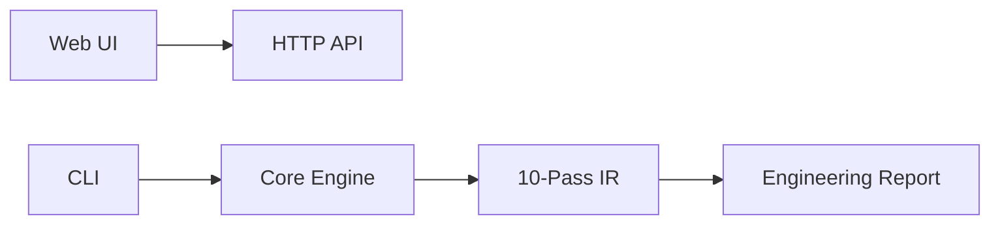

# Awesome NEURAX

A curated list of awesome resources, tutorials, articles, and tools for NEURAX.

---

## 📚 Official Resources

### Documentation
- [Official Documentation](https://rustnew.github.io/NEURAX/) - Complete guide to NEURAX
- [API Reference](docs/API_REFERENCE.md) - REST API documentation
- [Architecture Design](docs/DESIGN.md) - System architecture deep-dive
- [Deployment Guide](docs/DEPLOYMENT.md) - Production deployment

### Examples
- [Reference Models](examples/models/) - 88 pre-configured architectures
- [GPT-2 Small](examples/models/gpt2_small.json) - Classic transformer
- [LLaMA 2 7B](examples/models/llama2_7b.json) - LLaMA architecture
- [Mixtral 8x7B](examples/models/mixtral_8x7b.json) - Mixture-of-Experts
- [Stable Diffusion](examples/models/stable_diffusion.json) - Diffusion model

---

## 🎓 Tutorials

### Getting Started
- [Quick Start Guide](README.md#getting-started) - Set up NEURAX in 5 minutes
- [First Analysis](docs/tutorials/first-analysis.md) - Analyze your first model
- [Visual Canvas](docs/tutorials/visual-canvas.md) - Using the drag-and-drop interface
- [CLI Basics](docs/tutorials/cli-basics.md) - Command-line fundamentals

### Advanced
- [Custom Architectures](docs/tutorials/custom-architectures.md) - Design from scratch
- [MLIR Backend](docs/tutorials/mlir-backend.md) - Generate MLIR code
- [API Integration](docs/tutorials/api-integration.md) - Use the REST API
- [Parallelism Strategies](docs/tutorials/parallelism.md) - Optimize distributed training

---

## 🛠️ Tools & Integrations

### CLI Tools
- `neurax-cli` - Official command-line interface
- `neurax-tui` - Terminal user interface

### IDE Extensions
- [VS Code Extension](https://marketplace.visualstudio.com/items?itemName=neurax) - Syntax highlighting for model configs

### Integrations
- HuggingFace Hub (coming soon)
- Weights & Biases (coming soon)
- PyTorch Lightning (coming soon)
- MLflow (coming soon)

---

## 📊 Benchmarks

### Validation Results
- [Benchmark Suite](BENCHMARKS.md) - Public benchmark results
- [Accuracy Report](benchmarks/accuracy.md) - Prediction accuracy vs reality

---

## 📝 Articles & Blog Posts

### Official Blog
- [Why We Built NEURAX](https://neurax.ai/blog/why-neurax) - Origin story
- [The Science Behind Analytical Compilation](https://neurax.ai/blog/science) - Technical deep-dive
- [NEURAX vs Traditional Profilers](https://neurax.ai/blog/comparison) - Comparison guide

### Community Articles
- [Analyzing LLaMA 2 with NEURAX](https://dev.to/neurax-llama2) - Tutorial
- [Optimizing MoE Models](https://medium.com/neurax-moe) - Case study

---

## 🎥 Videos

### Official Videos
- [NEURAX in 5 Minutes](https://youtube.com/watch?v=xxxxx) - Quick demo
- [Design Your First Transformer](https://youtube.com/watch?v=xxxxx) - Tutorial
- [Architecture Deep-Dive](https://youtube.com/watch?v=xxxxx) - Technical talk

### Conference Talks
- [NeurIPS 2026: Analytical Compilation for Neural Nets](https://youtube.com/watch?v=xxxxx)

---

## 🧪 Examples & Recipes

### Common Use Cases

#### Estimate Training Cost
```bash
neurax analyze model.json --hardware a100-sxm --tokens 300B
```

#### Compare Hardware
```bash
neurax compare model.json --hardware a100,h100,l40s
```

#### Find Optimal Batch Size
```bash
neurax optimize model.json --gpu vram 80GB
```

#### Export to ONNX
```bash
neurax export model.json --format onnx --output model.onnx
```

---

## 🏢 Case Studies

Real-world applications of NEURAX:
- [Reducing Training Costs by 40%](CASE_STUDIES.md#case-study-1) - Research Lab X
- [Preventing OOM Errors](CASE_STUDIES.md#case-study-2) - Startup Y
- [Edge Deployment](CASE_STUDIES.md#case-study-3) - IoT Company Z
- [Optimizing MoE Training](CASE_STUDIES.md#case-study-4) - AI Lab W

---

## 🤝 Community

### Discussion Forums
- [GitHub Discussions](https://github.com/rustnew/NEURAX/discussions) - Q&A and ideas
- [Discord](https://discord.gg/neurax) - Real-time chat
- [Twitter](https://twitter.com/neurax_ai) - News and updates

### Contributing
- [Contributing Guide](CONTRIBUTING.md) - How to contribute
- [Good First Issues](https://github.com/rustnew/NEURAX/issues?q=is%3Aissue+is%3Aopen+label%3A%22good+first+issue%22) - Start here
- [Roadmap](docs/ROADMAP.md) - Future plans

---

## 📦 Packages & Libraries

### Official Packages
- `neurax-cli` - Cargo package
- `@neurax/sdk` - npm package (coming soon)
- `neurax` - PyPI package (coming soon)

### Community Packages
- [neurax-python](https://github.com/user/neurax-python) - Python SDK
- [neurax-js](https://github.com/user/neurax-js) - JavaScript SDK

---

## 🎨 Architecture Diagrams

### System Architecture


### IR Pipeline

```mermaid
graph LR
    Input --> Arch[Architecture IR]
    Arch --> Graph[Graph IR]
    Graph --> Tensor[Tensor IR]
    Tensor --> Operator[Operator IR]
    Operator --> Compute[Compute IR]
    Compute --> Memory[Memory IR]
    Memory --> Parallel[Parallelism IR]
    Parallel --> Hardware[Hardware IR]
    Hardware --> Cost[Cost IR]
    Cost --> Report[Report IR]
    Report --> Output
```


---

## 📈 Roadmap

See [Roadmap v2.0](docs/ROADMAP.md) for planned features:
- Public benchmark suite
- PyTorch/HuggingFace export
- Real-time training monitoring
- Multi-user collaboration
- Cloud deployment

---

## 🙏 Acknowledgments

NEURAX is built on:
- [MLIR](https://mlir.llvm.org/) - Multi-Level IR
- [LLVM](https://llvm.org/) - Compiler infrastructure
- [Rust](https://rust-lang.org/) - Systems programming
- [React](https://react.dev/) - UI framework

---

## 📜 License

NEURAX is licensed under the [MIT License](LICENSE).

---

**Want to add something?** Open a PR! This list is community-maintained.

**Last updated:** August 6, 2026
