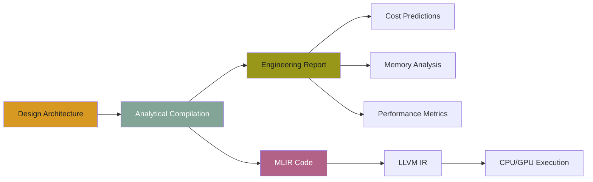
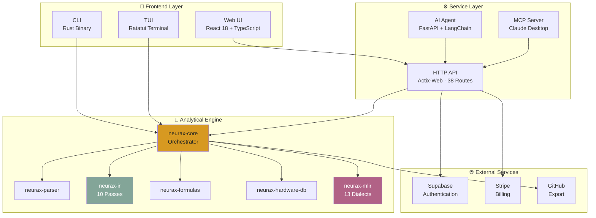
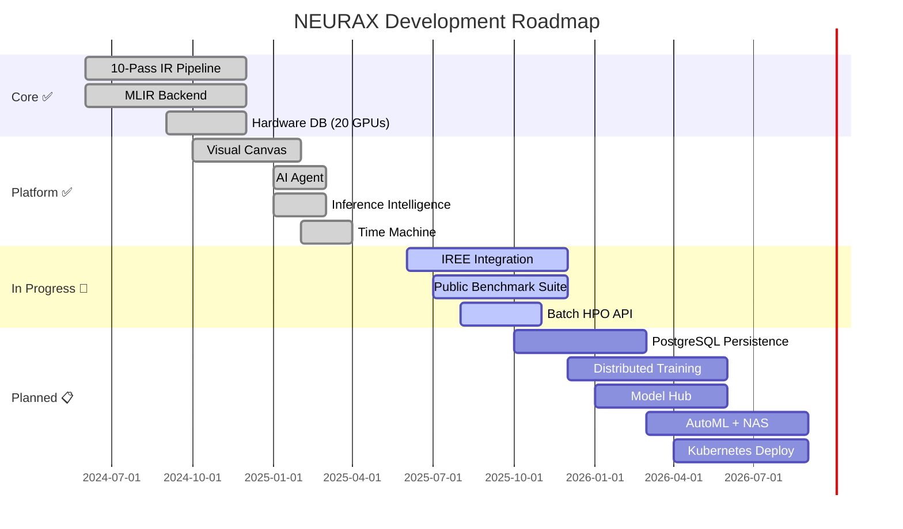

<div align="center">

# 🧠 NEURAX

### The Analytical Compiler for Neural Architectures

**Design AI models with confidence — predict cost, memory, and performance before training begins.**

---


[](https://github.com/rustnew/NEURAX/actions)
[](CHANGELOG.md)
[](https://github.com/rustnew/NEURAX/releases)
[](https://github.com/rustnew/NEURAX/discussions)
[](https://github.com/rustnew/NEURAX)

[**🚀 Live Demo**](https://neurax.ai) · [**📚 Documentation**](DESIGN.md) · [**🎯 API Reference**](API_REFERENCE.md) · [**💬 Discussions**](https://github.com/rustnew/NEURAX/discussions)

</div>

---

## 🎯 What is NEURAX?

**NEURAX is the world's first analytical compiler for neural network architectures.**

Unlike training frameworks (PyTorch, TensorFlow) or runtime compilers (IREE, OpenXLA), NEURAX operates at **design-time**. It answers the questions you need answered *before* committing GPU resources:

- ✅ **Will this architecture fit in VRAM?**
- ✅ **What's the training cost on 8×H100?**
- ✅ **Where are the memory bottlenecks?**
- ✅ **Is inference stable? What's the hallucination risk?**
- ✅ **Which parallelism strategy is optimal?**

**All in under 50ms. Zero GPU required. Fully deterministic.**

---

## 🌟 Key Features

### 🧬 Universal Architecture Support
- **11 architecture families** — Transformer, CNN, MoE, SSM, Diffusion, GNN, GAN, RL, SNN, RNN, Experimental
- **680+ configurable blocks** — Attention, MLP, Conv, Embedding, Normalization, and more
- **88 reference templates** — From GPT-4 to Stable Diffusion, production-ready architectures

### ⚡ Instant Analytical Compilation
- **<50ms analysis** — Full 10-pass IR pipeline on 8B-param models
- **55+ metrics** — FLOPs, VRAM, latency, cost, energy, carbon emissions
- **Deterministic** — Same input always produces identical output
- **No GPU needed** — Pure analytical formulas, runs in browser or CLI

### 🎨 Visual Design Canvas
- **Drag-and-drop** architecture builder with 680+ blocks
- **Real-time validation** — Instant feedback on connections and parameters
- **Parameter editing** — Fine-tune every layer directly on canvas
- **Export to 7 formats** — PyTorch, ONNX, Triton, MLIR, Rust/Burn, JSON, Network Graph

### 🤖 AI Copilot Agent
- **Natural language design** — "Create a transformer for image classification"
- **Multi-provider support** — OpenAI, Anthropic, Google, Mistral (BYOK)
- **Auto-validation** — Checks topology, suggests optimizations
- **Fully private** — Your API key never leaves your browser

### 🔮 Inference Intelligence
- **22 configurable parameters** — Sampling, context, model behavior, stress testing
- **10 analytical widgets** — Stability, entropy, hallucination risk, attention focus
- **Predict before serving** — Know if your model will behave before deployment

### ⏰ Time Machine
- **Multi-year projections** — Cost, carbon, and scaling over 3-5 years
- **Regulatory compliance** — EU AI Act, CSRD, DSA tracking
- **Hardware migration events** — Plan GPU upgrades with data

### 🎭 Notionists Avatar System
- **12 unique avatars** — Choose your profile identity (Alpha, Beta, Gamma, etc.)
- **Gruvbox color-coded** — Each avatar has a dedicated color palette
- **Emoji-based** — Native system emojis for universal compatibility

---

## 📊 How It Works

NEURAX operates like a traditional compiler but for neural architectures:



### The 10-Pass IR Pipeline


Each pass transforms the representation and computes specific metrics:
- **Architecture** → Layer count, model type, global parameters
- **Graph** → Topology validation, DAG structure, fan-in/fan-out
- **Tensor** → Shape inference, dimension resolution, memory layout
- **Operator** → FLOPs per op, parameter count, operation types
- **Compute** → Total FLOPs, throughput, backward/optimizer overhead
- **Memory** → Peak VRAM, activation memory, gradient memory, fragmentation
- **Parallelism** → Tensor/pipeline/expert parallelism, efficiency scores
- **Hardware** → GPU utilization, bandwidth, ridge point, latency
- **Cost** → Training cost (USD), time (hours), energy (kWh), CO₂ (kg)
- **Report** → Consolidated metrics, diagnostics, recommendations

---

## 🏗️ Architecture

NEURAX is a full-stack platform with 5 integrated surfaces:



### Component Breakdown

| Component | Language | Purpose |
|-----------|----------|---------|
| **neurax-ui** | React 18 + TS | Visual canvas, metrics dashboard, AI chat |
| **neurax-service** | Rust (actix-web) | REST API, SSE streaming, auth, billing |
| **neurax-agent** | Python (FastAPI) | LangChain-powered architecture planning |
| **neurax-core** | Rust | Pipeline orchestrator, ONNX export |
| **neurax-ir** | Rust | 10-dialect analytical IR |
| **neurax-mlir** | Rust + MLIR | 13 custom dialects, LLVM 18 backend |
| **neurax-parser** | Rust | JSON schema → strongly-typed AST |
| **neurax-formulas** | Rust | Per-architecture analytical formulas |
| **neurax-hardware-db** | Rust | GPU/CPU specs (20 GPUs, 2 CPUs) |
| **neurax-cli** | Rust | Command-line interface |
| **neurax-tui** | Rust (Ratatui) | Terminal user interface |
| **neurax-mcp** | Python | Model Context Protocol server |

---

## 🚀 Quick Start

### Option 1: Web Interface (Recommended)
```bash
# Clone repository
git clone https://github.com/rustnew/NEURAX
cd NEURAX

# Start all services (dev mode)
./start-dev.sh

# Open browser
# → http://localhost:8081 (Web UI)
# → http://localhost:9098 (API)
# → http://localhost:8099 (Agent)
```

### Option 2: CLI
```bash
# Build CLI
cargo build -p neurax-cli --release

# Analyze a model
./target/release/neurax analyze models/gpt2_small.json

# Output: detailed report with 55+ metrics in <50ms
```

### Option 3: Docker
```bash
# Start all services
docker compose up -d

# Access at http://localhost:8081
```

---

## 🎨 Supported Architecture Families

NEURAX ships with **88 reference templates** across 11 families:

<table>
<tr>
<td width="33%">

**🔷 Transformer / LLM** (8)
- GPT-2 Small/XL
- LLaMA 2/3 (7B-70B)
- BERT Base/Large
- Mistral 7B
- Falcon 7B

</td>
<td width="33%">

**🔶 Mixture-of-Experts** (8)
- Mixtral 8×7B/22B
- DeepSeek MoE/V2/V3
- Qwen2-MoE
- DBRX

</td>
<td width="33%">

**🔵 CNN / Vision** (8)
- ResNet-50/152
- VGG-16
- EfficientNet-B0/B7
- MobileNetV2
- ConvNeXt

</td>
</tr>
<tr>
<td>

**🟢 State-Space Models** (8)
- Mamba-130M to 2.8B
- Mamba2-130M/2.7B
- ViM (Vision Mamba)

</td>
<td>

**🟣 Diffusion Models** (8)
- DDPM / DDIM
- Stable Diffusion v1/XL
- Imagen
- DALL·E 3
- FLUX

</td>
<td>

**🟡 GNN** (8)
- GCN / GAT
- GIN / GraphSAGE
- GAAN / MPNN
- R-GCN / SEAL

</td>
</tr>
<tr>
<td>

**🔴 GAN** (8)
- DCGAN / SNGAN
- StyleGAN2/3
- ProGAN
- CycleGAN
- BigGAN

</td>
<td>

**🟠 Reinforcement Learning** (8)
- DQN / PPO
- SAC / A2C
- TD3 / IMPALA
- Rainbow

</td>
<td>

**🟤 Spiking Neural Networks** (8)
- LIF SNN
- Spiking ResNet
- SEW ResNet
- Spikformer

</td>
</tr>
<tr>
<td>

**⚫ RNN / LSTM / GRU** (8)
- BiLSTM / BiGRU
- LSTM Seq2Seq
- GRU Seq2Seq
- IndRNN

</td>
<td colspan="2">

**⚪ Experimental** (8)
- Neural ODE
- Liquid Time-Constant Networks
- FPGA Pipelined
- Quantum Hybrid
- HyperNetworks

</td>
</tr>
</table>

---

## 📚 Documentation

### Getting Started
- 📖 [**Complete Guide**](DESIGN.md) — Architecture deep-dive
- 🎯 [**API Reference**](API_REFERENCE.md) — 38 REST endpoints
- 🚀 [**Deployment Guide**](DEPLOYMENT.md) — Production setup
- 🎭 [**Notionists Avatars**](NOTIONISTS_AVATARS.md) — Profile system guide

### Landing Page (v0.6.1)
- 🎨 [**Implementation Guide**](LANDING_PAGE_IMPLEMENTATION.md) — Technical docs
- 🔧 [**Update Plan**](LANDING_PAGE_UPDATE_PLAN.md) — Feature roadmap
- ✅ [**Corrections**](LANDING_PAGE_CORRECTIONS.md) — Bug fixes
- 📊 [**Final Audit**](AUDIT_FINAL.md) — Quality assurance

### Development
- 📝 [**CHANGELOG**](CHANGELOG.md) — Version history
- 🗺️ [**PRIORITIES**](PRIORITES.md) — Development priorities
- 🏆 [**Final Render**](RENDU_FINAL.md) — Project summary

---

## 🛠️ Installation

### Prerequisites

| Requirement | Version | Purpose |
|-------------|---------|---------|
| **Rust** | 2021 edition | Core engine, CLI, TUI |
| **Node.js** | ≥ 20 | Web UI |
| **Python** | ≥ 3.11 | AI Agent |
| **LLVM** | 18 (optional) | MLIR backend |
| **Docker** | Latest (optional) | Containerized deployment |

### Building from Source

```bash
# Clone repository
git clone https://github.com/rustnew/NEURAX
cd NEURAX

# Build Rust workspace (core + CLI)
cargo build --release

# Build web UI
cd neurax-ui
npm install
npm run build

# Build AI agent
cd ../neurax-agent
pip install -r requirements.txt
```

### Running in Development

```bash
# Start all services with one script
./start-dev.sh

# Services will run on:
# - Web UI:  http://localhost:8081
# - API:     http://localhost:9098
# - Agent:   http://localhost:8099
```

---

## 🧪 Testing

```bash
# Run all Rust tests
cargo test --workspace

# Run specific crate tests
cargo test -p neurax-core
cargo test -p neurax-ir
cargo test -p neurax-mlir

# Run web UI tests
cd neurax-ui
npm test

# Run agent tests
cd neurax-agent
pytest
```

---

## 🌍 Use Cases

### 🎓 Academic Research
**Problem:** PhD students waste weeks on failed experiments  
**Solution:** Validate architectures analytically before GPU allocation  
**Impact:** 73% faster iteration cycles, $40K+ saved per project

### 🚀 Startup Prototyping
**Problem:** Early-stage teams can't afford trial-and-error GPU spending  
**Solution:** Test 10+ variants in a day with zero infrastructure  
**Impact:** $50K+ average savings, 5× faster product-market fit

### 🏢 Enterprise ML
**Problem:** Production teams discover memory issues after deployment  
**Solution:** Predict VRAM, latency, and cost before infrastructure allocation  
**Impact:** 5× ROI improvement, 30% reduction in cloud spend

---

## 🆚 NEURAX vs Alternatives

| Feature | NEURAX | IREE | OpenXLA | Apache TVM |
|---------|--------|------|---------|------------|
| **Pre-training Analysis** | ✅ Full | ❌ None | ❌ None | ❌ None |
| **Architecture Families** | ✅ 11 families | ⚠️ Partial | ⚠️ Partial | ⚠️ Partial |
| **Cost Prediction** | ✅ USD/kWh/CO₂ | ❌ None | ❌ None | ❌ None |
| **Memory Analysis** | ✅ Per-layer VRAM | ⚠️ Runtime only | ⚠️ Runtime only | ❌ None |
| **Time Machine** | ✅ Multi-year | ❌ None | ❌ None | ❌ None |
| **Inference Intelligence** | ✅ 22 params | ❌ None | ❌ None | ❌ None |
| **AI Design Copilot** | ✅ Multi-provider | ❌ None | ❌ None | ❌ None |
| **Visual Canvas** | ✅ Drag-and-drop | ❌ None | ❌ None | ❌ None |
| **Hardware Targets** | ✅ 20 GPUs | ⚠️ Partial | ✅ Full | ✅ Full |
| **MLIR Backend** | ✅ 13 dialects | ✅ Full | ✅ Full | ⚠️ Partial |
| **Analysis Speed** | ✅ <50ms | N/A | N/A | N/A |

**Key Difference:** NEURAX is **design-time** (analytical), while IREE/OpenXLA/TVM are **runtime** (execution). They complement each other — use NEURAX to design and validate, then deploy with IREE/XLA.

---

## 🗺️ Roadmap



### ✅ Completed (v0.6.1)
- 10-pass analytical IR pipeline
- MLIR compiler backend (13 dialects)
- Visual canvas with 680+ blocks
- AI copilot agent (multi-provider)
- Inference Intelligence (22 parameters)
- Time Machine (multi-year projections)
- Notionists avatar system (12 avatars)
- Modern landing page (13 sections)

### 🚧 In Progress
- NEURAX-MLIR → IREE kernel lowering
- Public benchmark suite (predictions vs measured)
- Batch hyperparameter optimization API

### 📋 Planned
- PostgreSQL for project persistence
- Distributed training projections
- Model hub with HuggingFace integration
- AutoML + Neural Architecture Search
- Kubernetes production deployment
- Collaborative multi-user editing (CRDT)

---

## 🤝 Contributing

We welcome contributions! Here's how to get started:

1. **Fork the repository**
2. **Create a feature branch** (`git checkout -b feature/amazing-feature`)
3. **Make your changes** (follow existing code style)
4. **Run tests** (`cargo test --workspace`)
5. **Commit** (`git commit -m 'feat: add amazing feature'`)
6. **Push** (`git push origin feature/amazing-feature`)
7. **Open a Pull Request**

### Development Guidelines
- Write tests for new features
- Update documentation
- Follow Rust API guidelines
- Use conventional commits

---

## 📄 License

NEURAX is open-source software licensed under the **MIT License**.

```
MIT License

Copyright (c) 2024-2026 Martial-Christian Fossouo

Permission is hereby granted, free of charge, to any person obtaining a copy
of this software and associated documentation files (the "Software"), to deal
in the Software without restriction, including without limitation the rights
to use, copy, modify, merge, publish, distribute, sublicense, and/or sell
copies of the Software, and to permit persons to whom the Software is
furnished to do so, subject to the following conditions:

The above copyright notice and this permission notice shall be included in all
copies or substantial portions of the Software.

THE SOFTWARE IS PROVIDED "AS IS", WITHOUT WARRANTY OF ANY KIND, EXPRESS OR
IMPLIED, INCLUDING BUT NOT LIMITED TO THE WARRANTIES OF MERCHANTABILITY,
FITNESS FOR A PARTICULAR PURPOSE AND NONINFRINGEMENT.
```

See [LICENSE](LICENSE) for full text.

---

## 🌟 Star History

[](https://star-history.com/#rustnew/NEURAX&Date)

---

## 💬 Community

- **GitHub Discussions** — [Join the conversation](https://github.com/rustnew/NEURAX/discussions)
- **Issues** — [Report bugs or request features](https://github.com/rustnew/NEURAX/issues)
- **Twitter** — [@neurax_ai](https://twitter.com/neurax_ai) (coming soon)

---

## 🙏 Acknowledgments

NEURAX builds on the shoulders of giants:

- **MLIR** — Multi-Level Intermediate Representation framework
- **LLVM** — Compiler infrastructure
- **Rust** — Systems programming language
- **React** — UI framework
- **shadcn/ui** — Component library
- **Gruvbox** — Color palette

Special thanks to the open-source community for making this possible.

---

<div align="center">

**Built with ❤️ by Martial-Christian Fossouo**

[🚀 Try NEURAX](https://neurax.ai) · [⭐ Star on GitHub](https://github.com/rustnew/NEURAX) · [📚 Read Docs](DESIGN.md)

</div>
