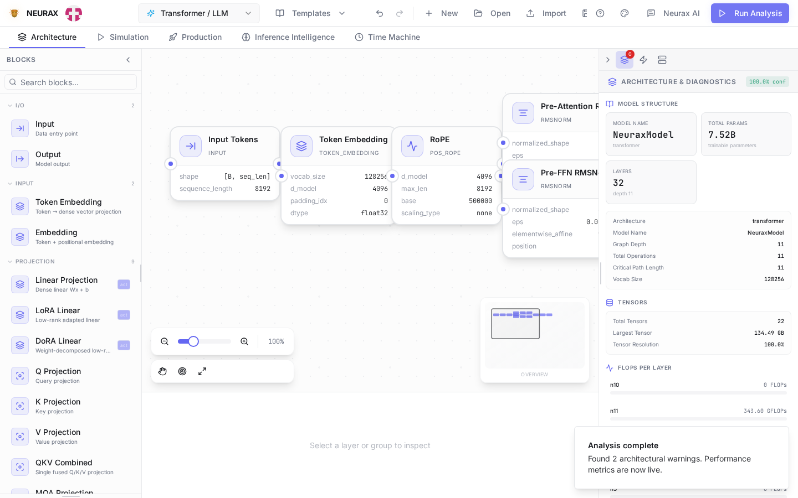
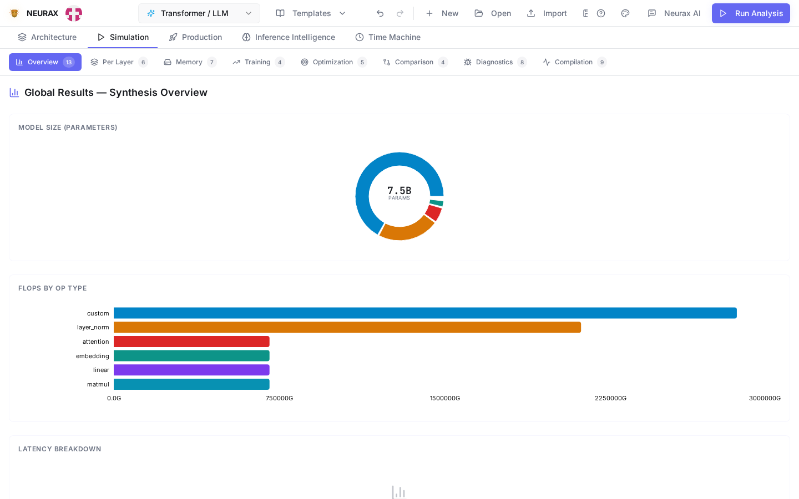

# NEURAX

**Know what a model costs — before you spend a single GPU-hour finding out.**

The usual way to find out an architecture doesn't fit is to launch the training run and watch it OOM six hours in — or finish, and cost three times what you budgeted, because nothing checked before you committed the GPU-hours. NEURAX checks first. Point it at an architecture — a full LLM or a small model built for your own dataset — and it hands back memory, speed, and training cost in under 50 milliseconds. No GPU, no training run, no waiting to find out.

[](https://github.com/rustnew/NEURAX/actions)
[](https://github.com/rustnew/NEURAX/releases)
[](LICENSE)

<p align="center">
  
</p>

## Install it now

```bash
curl -fsSL https://raw.githubusercontent.com/rustnew/NEURAX/main/install.sh | sh
```

Then type `neurax`, or open **NEURAX** from your applications menu. That's the entire install — no `sudo`, nothing written outside your home directory, nothing to sign up for.

Runs on **Debian, Ubuntu, Kali, Arch, Fedora, and effectively any Linux**, plus **macOS** (Intel and Apple silicon). Verified live, not assumed: while writing this, a real run of this exact command downloaded the app, installed it, and launched it for real.

Not sure yet? Read the install script before running it — one file, plain shell: [`install.sh`](install.sh).

## What it gives you

<p align="center">
  
</p>

Drag blocks onto a canvas, or load one of 88 real reference architectures, and get:

- **Will it fit?** Peak VRAM, activations, optimizer state — to the byte.
- **What will it cost?** Training time, dollars, energy, CO₂ — on the hardware you actually have.
- **Where's the bottleneck?** FLOPs by operation, per layer, memory- or compute-bound.
- **Will it behave?** Inference stability and hallucination risk, before you serve a token.

Every number is computed from the architecture you built, live — not a lookup table.

**This isn't only for people who already have a research cluster.** A small, specialized model tuned to your own dataset gets the same precise answer as a 70B one. That's the common case NEURAX is built for.

## It doesn't ask for anything

- No account to create — a local profile is generated automatically, kept on your machine.
- No API key leaves your browser — the AI copilot (bring your own key: OpenAI, Anthropic, Gemini, Mistral, Fireworks, DeepSeek, GLM, or any custom endpoint) talks straight to your chosen provider.
- No project ever uploaded anywhere. The compiler runs on your machine; that's the whole design.

## Accuracy, measured

Every reference model is checked against its real published size by an automated test — not eyeballed once:

| Model | Published | NEURAX | Error |
|---|---|---|---|
| Mixtral 8x7B | 46.7 B | 47.4 B | +1.5 % |
| LLaMA-2 70B | 70.0 B | 68.7 B | −1.8 % |
| DeepSeek-V3 | 671 B | 701 B | +4.5 % |
| Mamba 2.8B | 2.80 B | 2.66 B | −4.9 % |

Four of these were wrong before that test existed — one by +122%. That's why the test exists, and why it still runs on every change.

## Learn more

The one-liner above is the reference way to run NEURAX — the desktop app, with the compiler embedded. For everything else — Windows and web builds, Docker, running it as a Rust library, the full architecture, the API reference — see the **[documentation](https://rustnew.github.io/NEURAX/)**.

[Contributing](CONTRIBUTING.md) · [Changelog](CHANGELOG.md) · [Security](SECURITY.md) · [License: MIT](LICENSE)

---

Built by Fossouo.
