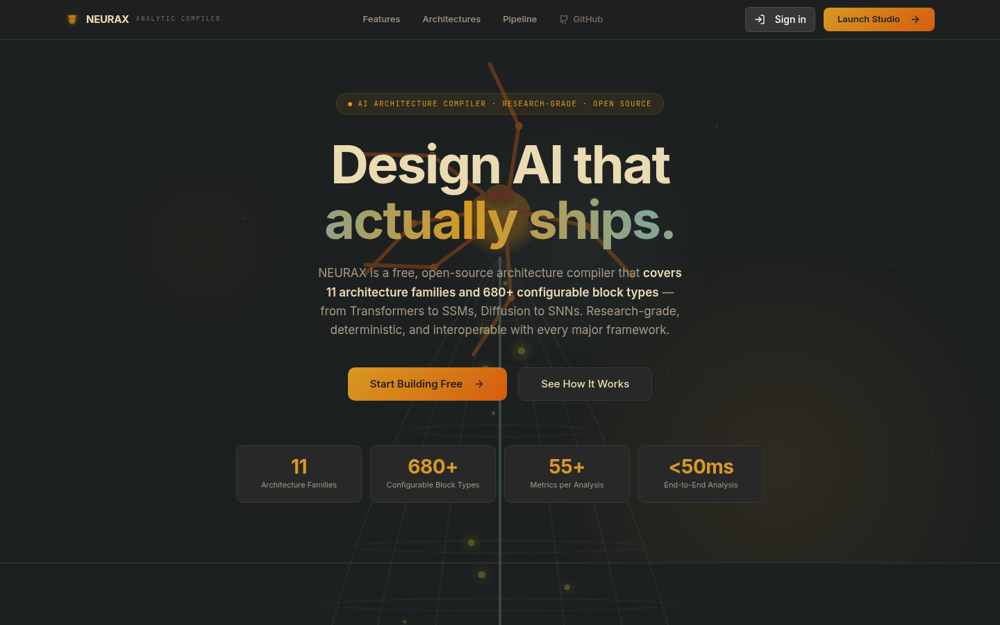
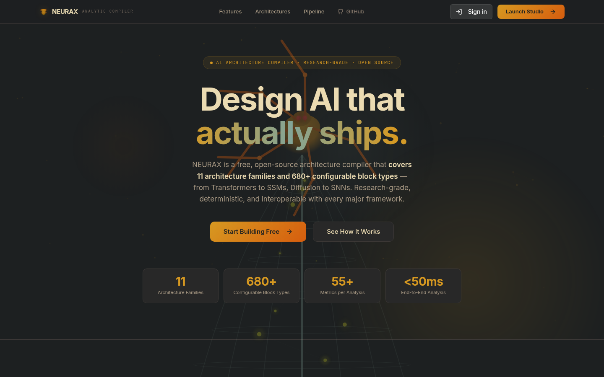
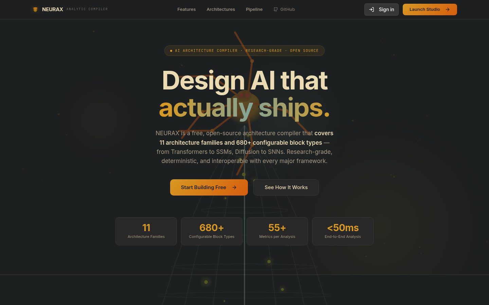

<div align="center">

<h1>⚡ NEURAX</h1>

### The Pre‑Flight Compiler for Artificial Intelligence

**_Know the cost, memory, speed, safety and feasibility of any AI model — in milliseconds, before a single GPU spins up._**

<br/>


[](CHANGELOG.md)

</div>

<div align="center">

### 📸 Platform Screenshots

<table>
<tr>
  <td align="center" width="50%">
    <br/>
    <sub><b>Architecture Canvas</b> — Visual drag‑and‑drop model designer</sub>
  </td>
  <td align="center" width="50%">
    <br/>
    <sub><b>Simulation Dashboard</b> — 40+ metrics, instant analytical results</sub>
  </td>
</tr>
<tr>
  <td align="center" width="50%">
    <br/>
    <sub><b>Inference Intelligence</b> — Stability prediction, hallucination risk, 10 widgets</sub>
  </td>
  <td align="center" width="50%">
    <br/>
    <sub><b>Time Machine</b> — Multi‑year cost, carbon & compliance projection</sub>
  </td>
</tr>
</table>

</div>

---

## Table of Contents

1. [Overview](#overview)
2. [Architecture](#architecture)
3. [Key Features](#key-features)
4. [Supported Model Families](#supported-model-families)
5. [The Web Platform](#the-web-platform)
6. [API Reference](#api-reference)
7. [Repository Structure](#repository-structure)
8. [Installation](#installation)
9. [Quick Start](#quick-start)
10. [Testing](#testing)
11. [Deployment](#deployment)
12. [Roadmap](#roadmap)
13. [License](#license)

---

## Overview

NEURAX is an **analytical compiler** for neural network architectures. It operates like a traditional compiler — front‑end (parser), multi‑stage intermediate representation (IR), optimization passes, and code‑generation backend — but instead of emitting machine code to be *executed*, it emits a complete **engineering report** of the model's behaviour on target hardware, **plus** real MLIR for downstream lowering.

```
             ┌──────────────┐      ┌────────────────────────────────┐      ┌──────────────┐
   model.json│   PARSER     │ AST  │      ANALYTICAL IR PIPELINE     │  IR  │   REPORT     │   40+ metrics
  ──────────▶│ typed config │─────▶│ arch ▸ graph ▸ tensor ▸ op ▸    │─────▶│  JSON / MD   │──────────▶
             └──────────────┘      │ compute ▸ memory ▸ paral ▸      │      └──────────────┘
                                   │ hardware ▸ cost ▸ report        │              │
                                   └────────────────────────────────┘              ▼
                                                   │                        ┌──────────────┐
                                                   └───────────────────────▶│  NEURAX-MLIR │  model.mlir
                                                        code generation      │   LLVM 18    │──────────▶
                                                                             └──────────────┘
```

**Why NEURAX?** Training a modern LLM costs millions of dollars. A single failed hyperparameter configuration can waste weeks and tens of thousands in GPU time. NEURAX lets you answer the critical questions *before* you commit resources:

- Will it fit in VRAM?
- What's the throughput on 8×H200?
- How much will a full training run cost?
- Where are the bottlenecks — compute, memory, or communication?
- What parallelism strategy is optimal?
- Is the inference stable? What's the hallucination risk?

---

## Architecture

NEURAX is a full‑stack platform with five integrated surfaces:

```
┌──────────────────────────────────────────────────────────────────────────────┐
│                              NEURAX PLATFORM                                  │
├────────────┬──────────┬────────────────┬──────────────┬──────────────────────┤
│   CLI      │   TUI    │   Web UI       │  HTTP API    │   AI Copilot Agent   │
│  (Rust)    │ (Ratatui)│ (React/TS)     │ (Actix-Web)  │  (Python/FastAPI)    │
│            │          │                │              │                      │
│ analyze    │ browser  │ Visual canvas   │ 37 REST      │ Planning + design    │
│ compile    │ explorer │ Drag & drop     │ endpoints    │ suggestions via SSE  │
│ validate   │ metrics  │ Live metrics    │ Streaming SSE│ LangChain powered    │
│ export     │          │ 88 templates    │ Auth+billing │                      │
└────────────┴──────────┴────────────────┴──────────────┴──────────────────────┘
                                      │
                                      ▼
┌──────────────────────────────────────────────────────────────────────────────┐
│                           ANALYTICAL ENGINE (Rust)                            │
│                                                                              │
│  neurax-parser ──▶ neurax-ir ──▶ neurax-core ──▶ neurax-mlir ──▶ IREE/LLVM  │
│                                                                              │
│  Backed by: neurax-formulas (FLOPs/params) + neurax-hardware-db (20 GPUs)    │
└──────────────────────────────────────────────────────────────────────────────┘
```

### Core Engine

| Crate | Role |
|---|---|
| `neurax-parser` | JSON schema ingestion → strongly‑typed `ModelConfig` |
| `neurax-ir` | Analytical IR with inference pass, graph/tensor/compute/memory/hardware/cost dialects |
| `neurax-core` | Pipeline orchestrator + ONNX export + streaming analysis |
| `neurax-mlir` | MLIR compiler backend — 15 custom dialects via `melior` bindings on LLVM 18 |
| `neurax-formulas` | Per‑architecture FLOPs, parameter count, and memory formulas |
| `neurax-hardware-db` | GPU/CPU/interconnect specification database (H100, A100, RTX, MI300X…) |

---

## Key Features

### Analytical Compiler
- **40+ metrics** across architecture, compute, memory, hardware, parallelism, cost, and energy
- **10‑pass IR pipeline**: Architecture → Graph → Tensor → Op → Compute → Memory → Parallelism → Hardware → Cost → Report
- **Streaming analysis** via Server‑Sent Events — see each phase complete in real time
- **Multi‑hardware comparison** (up to 8 configurations side‑by‑side)

### Inference Intelligence
- **22 configurable parameters** across sampling, context, model behavior, and stress testing
- **10 analytical widgets**: stability gauge, entropy evolution, hallucination risk, attention focus, context degradation, sampling volatility, router stability, risk overview
- Fully deterministic analytical model — no GPU needed, answers in milliseconds

### MLIR Code Generation
- **15 custom MLIR dialects** with lowering passes to LLVM IR
- Multi‑target backends: CPU, CUDA, ROCm, Metal, Vulkan — plus IREE integration
- TableGen (ODS) dialect definitions alongside Rust implementation

### Time Machine
- Compiler‑backed multi‑year cost, carbon, and scaling projection
- Break‑even point detection, hardware migration events
- Regulatory compliance tracking (EU AI Act, CSRD, DSA, US AI EO, Canada AIDA)

### AI Copilot Agent
- **FastAPI + LangChain** architecture‑planning agent
- Natural language design requests → topology suggestions via SSE streaming
- Validates against block catalogue, checks topology, lays out results
- **Adjustable creativity** dial — from conservative to experimental

---

## Supported Model Families

NEURAX ships with **88 reference architecture templates** across 11 families, each with real published parameters:

| Family | Examples | Count |
|---|---|---|
| **Transformer** | BERT‑base/large, GPT‑2 XL, LLaMA 2/3, Mistral, Falcon | 8 |
| **Mixture‑of‑Experts** | Mixtral 8×7B/22B, DeepSeek MoE/V2/V3, Qwen2‑MoE, DBRX | 8 |
| **CNN** | ResNet‑50/152, VGG‑16, EfficientNet‑B0/B7, MobileNetV2, ConvNeXt | 8 |
| **State‑Space Models** | Mamba‑130M/370M/790M/1.4B/2.8B, Mamba2‑130M/2.7B, ViM | 8 |
| **Diffusion** | DDPM, DDIM, Stable Diffusion v1/XL, Imagen, DALL·E 3, Midjourney, FLUX | 8 |
| **GNN** | GCN, GAT, GIN, GraphSAGE, GAAN, MPNN, R‑GCN, SEAL | 8 |
| **GAN** | DCGAN, SNGAN, SAGAN, StyleGAN2/3, ProGAN, CycleGAN, BigGAN | 8 |
| **Reinforcement Learning** | DQN, PPO MLP/CNN, SAC, A2C LSTM, TD3, IMPALA, Rainbow | 8 |
| **Spiking Neural Networks** | LIF SNN, Spiking ResNet, SEW ResNet, PLIF, Spiking VGG, TDST, Spikformer | 8 |
| **RNN** | BiLSTM, BiGRU, LSTM Seq2Seq, GRU Seq2Seq, IndRNN, Phased LSTM, SRU, JANET | 8 |
| **Experimental** | Neural ODE, Liquid Time‑Constant, FPGA Pipelined, Quantum Hybrid, HyperNetwork, NFN | 8 |

Each template includes 8–15 nodes with correct parameters, connections, and metadata — ready to load, customize, and analyze.

---

## The Web Platform

`neurax-ui` is a modern **React 18 + TypeScript + Vite** single‑page application providing a visual architecture design experience.

### Workspaces

| Tab | Function |
|---|---|
| **Architecture** | Visual canvas — drag‑and‑drop neural network layers, edit parameters, connect blocks |
| **Simulation** | Run the analytical pipeline — instant metrics dashboard with 40+ measurements |
| **Production** | Export to ONNX, download model definitions |
| **Time Machine** | Multi‑year cost/carbon scaling projection with regulatory compliance overlay |
| **Inference Intelligence** | Predict inference behavior — stability, hallucination risk, sampling quality |

### Key Components
- **Drag‑and‑drop canvas** with connector system and parameter editing
- **88 reference templates** loadable with one click, tagged by family
- **Real‑time metrics** — per‑layer breakdown, comparison charts, pie/bar visualizations
- **Hardware selector** — 20 GPUs with full specifications
- **Project management** — save, load, and delete cloud projects
- **AI Chat Drawer** — natural language architecture suggestions
- **Credits system** with plan‑based usage limits
- **Export panel** for ONNX binary and JSON model definitions

### Tech Stack
- **Framework**: React 18, TypeScript 5, Vite 8
- **UI**: TailwindCSS 3, shadcn/ui (Radix primitives), Lucide icons
- **Charts**: Recharts
- **State**: TanStack Query, React Context
- **Platform**: Supabase Auth, Stripe Billing

---

## API Reference

`neurax-service` is a production **actix‑web** HTTP server (default `0.0.0.0:9098`) exposing 37 REST endpoints with CORS, gzip compression, and authentication via Supabase JWT or API keys.

### Endpoint Summary

| Category | Endpoints | Description |
|---|---|---|
| **Analysis** | `POST /analyze`, `POST /analyze/stream`, `GET /analyze/stream/{id}`, `GET /analyze/result/{id}`, `GET /analyze/status/{id}`, `POST /analyze/compare` | Run analytical pipeline synchronously or with SSE streaming |
| **Inference** | `POST /inference/simulate` | Predict inference stability, hallucination risk, volatility |
| **Time Machine** | `POST /timemachine` | Multi‑year cost/carbon projection |
| **Projects** | `GET/POST /projects`, `GET/PUT/DELETE /projects/{id}` | Full CRUD for cloud project persistence |
| **Export** | `POST /export/onnx` | Binary ONNX protobuf export |
| **Presets** | `GET /presets`, `GET /presets/{id}` | Architecture reference templates |
| **Hardware** | `GET /hardware` | GPU specifications (20 GPUs, full specs) |
| **Billing** | `POST /billing/checkout`, `POST /billing/portal`, `POST /stripe/webhook` | Stripe checkout, billing portal, webhook |
| **Credits** | `GET /credits` | Usage balance and plan limits |
| **Compliance** | `GET /compliance/config` | Regulatory data (EU AI Act, CSRD, DSA…) |
| **API Keys** | `GET/POST /api-keys`, `POST/DELETE /api-keys/{id}/revoke` | Full programmatic API key management |
| **Agent** | `POST /agent/{analyze,inference,compare,audit,carbon}`, `GET /agent/{compliance,results,projects}` | External agent integration endpoints |
| **System** | `GET /health`, `GET /me` | Health check, user profile |

Authentication supports both **Supabase JWT** (web UI users) and **API keys** (programmatic access) with scope‑based authorization.

> Complete API documentation including request/response schemas is available in [API_REFERENCE.md](API_REFERENCE.md).

---

## Repository Structure

```
Conceptor/
├── Cargo.toml                     # Rust workspace (10+ crates)
├── docker-compose.yml             # 3‑service Docker orchestration
├── Dockerfile / .ui / .agent      # Multi‑service Dockerfiles
├── API_REFERENCE.md               # Full API documentation (37 endpoints)
├── DEPLOYMENT.md                  # Deployment guide
├── DESIGN.md                      # Architecture design notes
├── CHANGELOG.md                   # Release history
│
├── neurax-parser/                 # JSON ingestion → ModelConfig
├── neurax-ir/                     # Analytical IR + inference pass
├── neurax-core/                   # Pipeline orchestrator + ONNX export
├── neurax-mlir/                   # MLIR compiler backend (15 dialects, LLVM 18)
├── neurax-formulas/               # Per‑architecture FLOPs/parameter formulas
├── neurax-hardware-db/            # GPU/CPU specification database
│
├── neurax-cli/                    # `neurax` CLI (analyze, compile, validate, export)
├── neurax-tui/                    # Ratatui terminal interface
├── neurax-service/                # actix‑web HTTP API (37 endpoints)
├── neurax-ui/                     # React 18 + TypeScript + Vite web frontend
├── neurax-agent/                  # Python/FastAPI/LangChain planning agent
├── neurax-mcp/                    # MCP (Model Context Protocol) integration
│
├── models/                        # Sample model definitions
├── tests/                         # Integration tests
├── examples/                      # Bundled TUI examples
└── docs/                          # Internal documentation
```

### Rust Dependency Graph

```
neurax-cli ──┬──▶ neurax-core ──┬──▶ neurax-ir ──▶ neurax-formulas
             │                  ├──▶ neurax-parser
             │                  └──▶ neurax-hardware-db
             └──▶ neurax-mlir ──▶ neurax-parser              (feature "mlir")

neurax-tui / neurax-service ──▶ neurax-core
neurax-ui ──HTTP──▶ neurax-service ◀──HTTP── neurax-agent
```

---

## Installation

### Prerequisites

| Component | Requirement | Notes |
|---|---|---|
| **Rust** | Edition 2021 | [rustup.rs](https://rustup.rs) |
| **LLVM 18** | For MLIR backend only | `--features mlir` |
| **Node.js** | ≥ 20 | Web UI |
| **Python** | ≥ 3.11 | Agent only |

On Debian/Ubuntu for MLIR support:

```bash
sudo apt install llvm-18 llvm-18-dev libmlir-18-dev mlir-18-tools
export LLVM_SYS_180_PREFIX=/usr/lib/llvm-18
export MLIR_SYS_180_PREFIX=/usr/lib/llvm-18
export PATH="/usr/lib/llvm-18/bin:$PATH"
```

---

## Quick Start

### Build the CLI (no MLIR needed)

```bash
cargo build -p neurax-cli --release
./target/release/neurax analyze models/gpt2_small.json --format markdown
```

### Start the HTTP API

```bash
cargo run -p neurax-service
# Listening on http://0.0.0.0:9098
```

### Start the Web UI

```bash
cd neurax-ui
npm install
npm run dev
# Open http://localhost:8081
```

### Start the AI Agent

```bash
cd neurax-agent
pip install -r requirements.txt
python app.py
```

### Docker (all services)

```bash
docker compose up -d
```

### CLI Commands

```bash
# Full analytical report
neurax analyze models/gpt2_small.json --format json

# Validate a model definition
neurax validate models/mixtral_8x7b.json

# Quick summary
neurax summary models/deepseek_v3.json

# Full compilation pipeline (MLIR + LLVM IR + metrics)
neurax compile models/gpt2_small.json -o ./output --features mlir
```

---

## Testing

```bash
# Core analytical engine
cargo test -p neurax-core

# MLIR compiler (requires LLVM 18)
cargo test -p neurax-mlir

# Inference intelligence pass
cargo test -p neurax-ir -- inference

# All tests
cargo test --workspace
```

---

## Deployment

Production deployment uses Docker Compose with three services:

```bash
# Build and run all services
docker compose up -d --build

# Check health
curl http://localhost:9098/health     # API
curl http://localhost:8081            # Web UI
```

For detailed instructions including reverse proxy setup (nginx), SSL termination, and scaling, see [DEPLOYMENT.md](DEPLOYMENT.md).

---

## Roadmap

### ✅ Complete (v0.5.0)

| Phase | Feature | Status |
|---|---|---|
| Core | 10‑pass analytical IR pipeline | ✅ |
| Core | MLIR compiler backend (15 dialects, LLVM 18) | ✅ |
| Core | CLI: `analyze`, `compile`, `validate`, `summary` | ✅ |
| Core | Hardware database (20 GPUs) | ✅ |
| Phase 1 | Inference Intelligence — 22 params, 10 widgets | ✅ |
| Phase 2 | Streaming SSE analysis with auth | ✅ |
| Phase 3 | Multi‑hardware comparison (up to 8 configs) | ✅ |
| Phase 4 | Cloud project CRUD | ✅ |
| Phase 5 | ONNX binary export | ✅ |
| Phase 6 | Billing, credits, compliance, Docker | ✅ |
| Web | 88 reference architecture templates | ✅ |
| Web | Visual canvas, drag‑and‑drop, live metrics | ✅ |
| Web | Time Machine cost/carbon projection | ✅ |
| Web | AI Chat Drawer with agent integration | ✅ |
| Agent | Architecture planning via FastAPI + LangChain | ✅ |

### 🚧 In Progress

- Lower NEURAX‑MLIR to runnable kernels via IREE
- Public benchmark suite (predictions vs. measured runs)
- API key management UI in web frontend

### 📋 Planned

- Multi‑node distributed training projections
- Custom architecture plugin system
- Model zoo with HuggingFace integration
- Training data pipeline cost modeling
- Fine‑tuning cost projections (LoRA, QLoRA, full)

---

## License

MIT — © 2024–2026 Martial‑Christian.

<div align="center">
<br/>

**NEURAX** — _See the cost of intelligence, before you pay for it._

</div>
