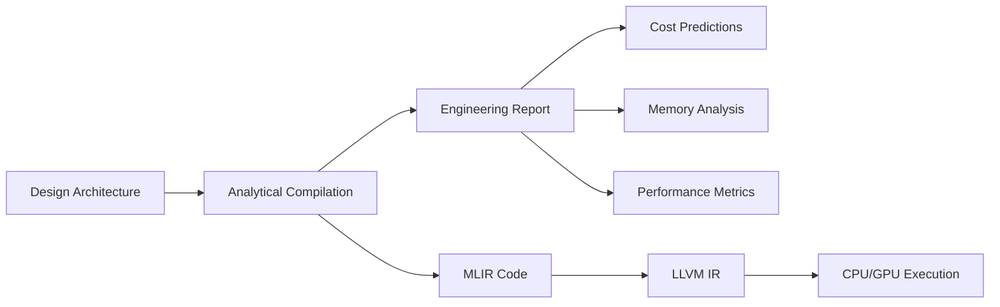
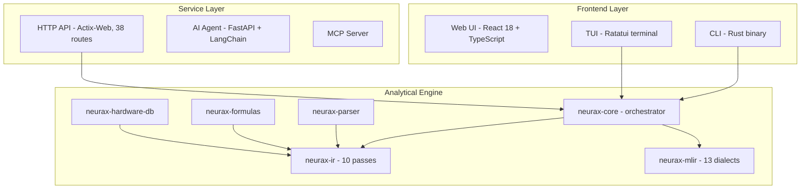

# NEURAX

**The Analytical Compiler for Neural Architectures**

NEURAX predicts the **cost, memory, and performance** of neural network architectures **before training** - in under 50 ms, with zero GPU, and fully deterministically.

[Live Demo](https://rustnew.github.io/NEURAX/) · [Documentation](https://rustnew.github.io/NEURAX/) · [API Reference](docs/API_REFERENCE.md) · [Releases](https://github.com/rustnew/NEURAX/releases) · [Contributing](CONTRIBUTING.md)

[](https://github.com/rustnew/NEURAX/actions)
[](https://github.com/rustnew/NEURAX/releases)
[](LICENSE)
[](https://www.rust-lang.org)
[](https://mlir.llvm.org)
[](https://react.dev)
[](https://github.com/sponsors/rustnew)

### Crates.io

[](https://crates.io/crates/neurax-core)
[](https://crates.io/crates/neurax-ir)
[](https://crates.io/crates/neurax-parser)
[](https://crates.io/crates/neurax-formulas)
[](https://crates.io/crates/neurax-hardware-db)
[](https://crates.io/crates/neurax-mlir)
[](https://crates.io/crates/neurax-cli)
[](https://crates.io/crates/neurax-tui)
[](https://crates.io/crates/neurax-service)

---

## Overview

NEURAX is an **analytical compiler** for neural network architectures. Whereas training frameworks (PyTorch, TensorFlow) execute models and runtime compilers (IREE, OpenXLA) lower them for execution, NEURAX operates at **design time**: it answers the questions you need resolved before committing GPU resources.

- Will this architecture fit in VRAM?
- What is the training cost on 8x H100?
- Where are the memory bottlenecks?
- Is inference stable? What is the hallucination risk?
- Which parallelism strategy is optimal?

All in under 50 ms. Zero GPU required. Fully deterministic.

---

## Key Capabilities

### Universal Architecture Support
- **11 architecture families** - Transformer, CNN, MoE, SSM, Diffusion, GNN, GAN, RL, SNN, RNN, Experimental.
- **208 configurable blocks** - Attention, MLP, Conv, Embedding, Normalization, and more.
  The count is asserted against the catalogue by `projectFacts.test.ts`; it said
  680+ for a long time and the catalogue has never held that many.
- **88 reference templates** - From GPT-4 to Stable Diffusion, production-ready architectures.

### Accuracy, measured

Every reference model is checked against its published parameter count by
`neurax-core/tests/published_model_accuracy.rs`:

| Model | Published | NEURAX | Error |
|---|---|---|---|
| VGG-16 | 138.0 M | 138.4 M | +0.3 % |
| Mixtral 8x7B | 46.7 B | 47.4 B | +1.5 % |
| LLaMA-2 70B | 70.0 B | 68.7 B | −1.8 % |
| ResNet-50 | 25.6 M | 26.5 M | +3.5 % |
| RWKV 7B | 7.5 B | 7.2 B | −4.2 % |
| DeepSeek-V3 | 671 B | 701 B | +4.5 % |
| Mamba 2.8B | 2.80 B | 2.66 B | −4.9 % |

Four of these were wrong before that test existed — Mixtral by +122 %,
DeepSeek by +108 %, RWKV by −96.7 %, LLaMA-2 by −28.7 % — because nothing
anywhere compared a computed figure to a known one. A 1.42-trillion-parameter
configuration is also checked, to catch arithmetic that wraps at that scale.

Seven models is what is measured. It is not a claim about every architecture
that exists.

### Instant Analytical Compilation
- **<50 ms analysis** - Full 10-pass IR pipeline on 8B-parameter models.
- **66 metrics** - FLOPs, VRAM, latency, cost, energy, carbon emissions.
- **Deterministic** - Identical input always produces identical output.
- **No GPU needed** - Pure analytical formulas; runs in the browser or CLI.

### Visual Design Canvas
- Drag-and-drop architecture builder with 208 blocks.
- Real-time validation of connections and parameters.
- Parameter editing directly on the canvas.
- Export to 3 targets - JSON, NEURAX IR, and GitHub.

  There used to be seven. The framework emitters among them produced a class
  whose `__init__` was empty and whose `forward` was a chain of `x2 = x1` — for
  LLaMA 2 7B, an identity function under the model's name — so they were
  removed rather than repaired in place. What leaves NEURAX now is the
  architecture itself, which it can describe truthfully.

### AI Copilot Agent
- Natural-language design - "Create a transformer for image classification".
- Multi-provider support - OpenAI, Anthropic, Google, Mistral (BYOK).
- Auto-validation of topology with optimization suggestions.
- Fully private - your API key never leaves the browser.

### Inference Intelligence
- 22 configurable parameters - sampling, context, model behavior, stress testing.
- 10 analytical widgets - stability, entropy, hallucination risk, attention focus.
- Predict before serving - know if your model will behave before deployment.

### Time Machine
- Multi-year cost, carbon, and scaling projections (3-5 years).
- Regulatory compliance - EU AI Act, CSRD, DSA tracking.
- Hardware migration planning with data.

---

## How It Works

NEURAX operates like a traditional compiler, but for neural architectures:



### The 10-Pass IR Pipeline

```mermaid
graph LR
    Input[model.json] --> P1[1. Architecture IR]
    P1 --> P2[2. Graph IR]
    P2 --> P3[3. Tensor IR]
    P3 --> P4[4. Operator IR]
    P4 --> P5[5. Compute IR]
    P5 --> P6[6. Memory IR]
    P6 --> P7[7. Parallelism IR]
    P7 --> P8[8. Hardware IR]
    P8 --> P9[9. Cost IR]
    P9 --> P10[10. Report IR]
    P10 --> Output[report.json]
```



Each pass transforms the representation and computes specific metrics:

| Pass | Computed metrics |
|------|------------------|
| Architecture | Layer count, model type, global parameters |
| Graph | Topology validation, DAG structure, fan-in/fan-out |
| Tensor | Shape inference, dimension resolution, memory layout |
| Operator | FLOPs per op, parameter count, operation types |
| Compute | Total FLOPs, throughput, backward/optimizer overhead |
| Memory | Peak VRAM, activation/gradient memory, fragmentation |
| Parallelism | Tensor/pipeline/expert parallelism, efficiency scores |
| Hardware | GPU utilization, bandwidth, ridge point, latency |
| Cost | Training cost (USD), time (hours), energy (kWh), CO2 (kg) |
| Report | Consolidated metrics, diagnostics, recommendations |

---

## Architecture

NEURAX is a full-stack platform with 5 integrated surfaces:



### Component Breakdown

| Component | Language | Purpose |
|-----------|----------|---------|
| **neurax-ui** | React 18 + TypeScript | Visual canvas, metrics dashboard, AI chat |
| **neurax-service** | Rust (actix-web) | REST API, SSE streaming, auth, billing |
| **neurax-agent** | Python (FastAPI) | LangChain-powered architecture planning |
| **neurax-core** | Rust | Pipeline orchestrator, ONNX export |
| **neurax-ir** | Rust | 10-dialect analytical IR |
| **neurax-mlir** | Rust + MLIR | 13 custom dialects, LLVM 18 backend |
| **neurax-parser** | Rust | JSON schema to strongly-typed AST |
| **neurax-formulas** | Rust | Per-architecture analytical formulas |
| **neurax-hardware-db** | Rust | GPU/CPU specs (20 GPUs, 2 CPUs) |
| **neurax-cli** | Rust | Command-line interface |
| **neurax-tui** | Rust (Ratatui) | Terminal user interface |
| **neurax-mcp** | Python | Model Context Protocol server |

---

## Repository Layout

```
.
├── neurax-core/          # Pipeline orchestrator, ONNX export
├── neurax-ir/            # 10-dialect analytical IR
├── neurax-mlir/          # 13 custom dialects, LLVM 18 backend
├── neurax-parser/        # JSON to strongly-typed AST
├── neurax-formulas/      # Analytical formulas
├── neurax-hardware-db/   # GPU/CPU spec database
├── neurax-cli/           # Command-line interface
├── neurax-tui/           # Terminal UI
├── neurax-service/       # Actix-web HTTP API (library + binary)
├── neurax-desktop/       # Tauri desktop app — the studio, offline
├── neurax-agent/         # Python AI planning agent
├── neurax-mcp/           # MCP server
├── neurax-ui/            # React web frontend
├── docs/                 # Project documentation
├── examples/models/      # Reference architecture configs
└── .github/workflows/    # CI (LLVM 18 / MLIR build)
```

---

## Getting Started

### Desktop application (recommended)

**Linux and macOS — one command:**

```bash
curl -fsSL https://raw.githubusercontent.com/rustnew/NEURAX/main/install.sh | sh
```

Then type `neurax` in a terminal, or open NEURAX from your applications menu.

That is all it does: download the bundle for your platform, put it under
`~/.local`, and add it to your applications menu. Nothing is written outside
your home directory and no step asks for sudo. To see it before running it,
read [`install.sh`](install.sh) — it is a single readable shell script.

| | |
|---|---|
| Pin a version | `curl -fsSL … \| sh -s -- --version v0.7.0` |
| Install elsewhere | `curl -fsSL … \| sh -s -- --prefix ~/opt` |
| Remove it | `curl -fsSL … \| sh -s -- --uninstall` |

**Windows**, and anyone who would rather not pipe a script into a shell:
download an installer from [Releases](https://github.com/rustnew/NEURAX/releases).

| Platform | File |
|---|---|
| Linux, any distribution | `NEURAX_<version>_amd64.AppImage` |
| Debian, Ubuntu | `NEURAX_<version>_amd64.deb` |
| Fedora, RHEL | `NEURAX-<version>.x86_64.rpm` |
| macOS, Intel and Apple silicon | `NEURAX_<version>_universal.dmg` |
| Windows | `NEURAX_<version>_x64-setup.exe` |

macOS will say the application is from an unidentified developer, because the
build is not notarized. The install script clears the quarantine flag for you;
if you installed the `.dmg` by hand, right-click the app and choose **Open**
once.

**What you get.** The same studio as the web application — same panels, same
analyses, same numbers — with the compiler running inside the application on a
loopback socket. No account, no upload, no network. Projects are kept on your
machine and are still there next time you open it.

Building it from source, and how it is put together, is in
[`neurax-desktop/README.md`](neurax-desktop/README.md).

### Web Interface

```bash
git clone https://github.com/rustnew/NEURAX.git
cd NEURAX
./start-dev.sh

# Web UI     -> http://localhost:8081
# API        -> http://localhost:9098
# Agent      -> http://localhost:8099
```

### CLI

```bash
# Install from crates.io
cargo install neurax-cli

# Or build from source
cargo build -p neurax-cli --release
./target/release/neurax analyze models/gpt2_small.json
```

### As a Rust library

```toml
[dependencies]
neurax-core = "0.1"   # full analytical pipeline
neurax-ir = "0.1"     # 10-pass analytical IR
neurax-parser = "0.1" # NEURAX JSON parser
```

```rust
use neurax_core::Neurax;

let neurax = Neurax::new();
let report = neurax.compile(model_json)?; // <50 ms, deterministic, no GPU
```

### Docker

```bash
docker compose up -d
# Access at http://localhost:8081
```

---

## Architecture Families

NEURAX ships with 88 reference templates across 11 families:

| Family | Examples |
|--------|----------|
| Transformer / LLM | GPT-2, LLaMA 2/3, BERT, Mistral 7B, Falcon 7B |
| Mixture-of-Experts | Mixtral, DeepSeek MoE, Qwen2-MoE, DBRX |
| CNN / Vision | ResNet, VGG, EfficientNet, MobileNetV2, ConvNeXt |
| State-Space Models | Mamba, Mamba2, ViM |
| Diffusion | DDPM, Stable Diffusion, Imagen, DALL-E 3, FLUX |
| GNN | GCN, GAT, GIN, GraphSAGE |
| GAN | DCGAN, StyleGAN, ProGAN, CycleGAN |
| Reinforcement Learning | DQN, PPO, SAC, A2C, TD3 |
| Spiking Neural Networks | LIF SNN, Spiking ResNet, Spikformer |
| RNN / LSTM / GRU | BiLSTM, LSTM Seq2Seq, GRU Seq2Seq |
| Experimental | Neural ODE, Liquid Time-Constant, Quantum Hybrid |

---

## Documentation

| Document | Description |
|----------|-------------|
| [Architecture & Design](docs/DESIGN.md) | System architecture, data flow, design principles |
| [API Reference](docs/API_REFERENCE.md) | 38 REST endpoints, auth, schemas |
| [Deployment Guide](docs/DEPLOYMENT.md) | Production and Docker deployment |
| [Roadmap v2.0](docs/ROADMAP.md) | Development roadmap |
| [Contributing](CONTRIBUTING.md) | Development workflow and code style |
| [CHANGELOG](CHANGELOG.md) | Version history |
| [Security](SECURITY.md) | Security policy and vulnerability reporting |

---

## Roadmap

### Completed (v0.6.x)
- 10-pass analytical IR pipeline
- MLIR compiler backend (13 dialects)
- Visual canvas with 208 blocks
- AI copilot agent (multi-provider)
- Inference Intelligence (22 parameters)
- Time Machine (multi-year projections)
- Multimodal (VLM) model support
- Modern landing page and avatar system

### In Progress
- NEURAX-MLIR to IREE kernel lowering
- Public benchmark suite (predictions vs measured)
- Batch hyperparameter optimization API

### Planned
- PostgreSQL for project persistence
- Distributed training projections
- Model hub with HuggingFace integration
- Fine-tuning cost projections (LoRA, QLoRA)
- Kubernetes production deployment
- Collaborative multi-user editing (CRDT)

---

## Releases & Versioning

NEURAX follows [Semantic Versioning](https://semver.org/). Releases are published on the [Releases page](https://github.com/rustnew/NEURAX/releases) and documented in the [CHANGELOG](CHANGELOG.md).

---

## Contributing

Contributions are welcome. See [CONTRIBUTING.md](CONTRIBUTING.md) for the development workflow, project layout, code style, and how to open a pull request. Please read the [Code of Conduct](CODE_OF_CONDUCT.md).

---

## Sponsors

NEURAX is free and open source, built and maintained by the community. Your sponsorship helps us keep the project sustainable and growing.

[](https://github.com/sponsors/rustnew) [](https://opencollective.com/neurax)

**Why sponsor NEURAX?**
- Support the development of the first analytical compiler for neural architectures
- Help democratize ML architecture design and save GPU costs
- Get your logo featured here and in our documentation

**Sponsorship tiers:**
- **$5/mo** - Thank you + name in our sponsors list
- **$25/mo** - Logo in the README + early access to new features
- **$100/mo** - Priority support + case study feature
- **$500/mo** - Monthly consultation + landing page logo

Every contribution, no matter the size, makes a difference. Thank you for supporting open source! 🙏

**Funding applications:**
- [GitHub Accelerator](docs/GITHUB_ACCELERATOR_APPLICATION.md)
- [Sentient Foundation ($42M)](docs/SENTIENT_FOUNDATION_APPLICATION.md)
- [Linux Foundation Grants ($12.5M)](docs/LINUX_FOUNDATION_APPLICATION.md)

**Community & growth:**
- [Go-To-Market Strategy](GO_TO_MARKET_STRATEGY.md)
- [ArXiv Technical Report](ARXIV_PAPER.md)
- [ArXiv Endorsement Outreach](docs/ARXIV_ENDORSEMENT_OUTREACH.md)
- [Zenodo Deposit Guide](docs/ZENODO_DEPOSIT.md)
- [Promotion Checklist](PROMOTION_CHECKLIST.md)
- [Social Media Assets](SOCIAL_MEDIA_ASSETS.md)

---

## License

NEURAX is open-source software licensed under the **MIT License**. See [LICENSE](LICENSE) for the full text.

---

## Acknowledgments

NEURAX builds on the shoulders of giants:

- **MLIR** - Multi-Level Intermediate Representation framework
- **LLVM** - Compiler infrastructure
- **Rust** - Systems programming language
- **React** - UI framework
- **shadcn/ui** - Component library

---

Built by  Fossouo.
