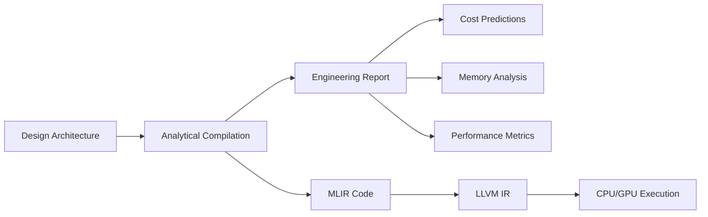
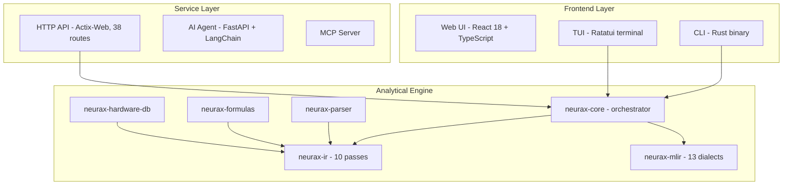

# NEURAX

**The Analytical Compiler for Neural Architectures**

NEURAX predicts the **cost, memory, and performance** of neural network architectures **before training** - in under 50 ms, with zero GPU, and fully deterministically.

[Live Demo](https://neurax.ai) · [Documentation](https://rustnew.github.io/NEURAX/) · [API Reference](docs/API_REFERENCE.md) · [Releases](https://github.com/rustnew/NEURAX/releases) · [Contributing](CONTRIBUTING.md)

[](https://github.com/rustnew/NEURAX/actions)
[](https://github.com/rustnew/NEURAX/releases)
[](LICENSE)
[](https://www.rust-lang.org)
[](https://mlir.llvm.org)
[](https://react.dev)

---

## Overview

NEURAX is an **analytical compiler** for neural network architectures. Whereas training frameworks (PyTorch, TensorFlow) execute models and runtime compilers (IREE, OpenXLA) lower them for execution, NEURAX operates at **design time**: it answers the questions you need resolved before committing GPU resources.

- Will this architecture fit in VRAM?
- What is the training cost on 8x H100?
- Where are the memory bottlenecks?
- Is inference stable? What is the hallucination risk?
- Which parallelism strategy is optimal?

All in under 50 ms. Zero GPU required. Fully deterministic.

---

## Key Capabilities

### Universal Architecture Support
- **11 architecture families** - Transformer, CNN, MoE, SSM, Diffusion, GNN, GAN, RL, SNN, RNN, Experimental.
- **680+ configurable blocks** - Attention, MLP, Conv, Embedding, Normalization, and more.
- **88 reference templates** - From GPT-4 to Stable Diffusion, production-ready architectures.

### Instant Analytical Compilation
- **<50 ms analysis** - Full 10-pass IR pipeline on 8B-parameter models.
- **55+ metrics** - FLOPs, VRAM, latency, cost, energy, carbon emissions.
- **Deterministic** - Identical input always produces identical output.
- **No GPU needed** - Pure analytical formulas; runs in the browser or CLI.

### Visual Design Canvas
- Drag-and-drop architecture builder with 680+ blocks.
- Real-time validation of connections and parameters.
- Parameter editing directly on the canvas.
- Export to 7 formats - PyTorch, ONNX, Triton, MLIR, Rust/Burn, JSON, Network Graph.

### AI Copilot Agent
- Natural-language design - "Create a transformer for image classification".
- Multi-provider support - OpenAI, Anthropic, Google, Mistral (BYOK).
- Auto-validation of topology with optimization suggestions.
- Fully private - your API key never leaves the browser.

### Inference Intelligence
- 22 configurable parameters - sampling, context, model behavior, stress testing.
- 10 analytical widgets - stability, entropy, hallucination risk, attention focus.
- Predict before serving - know if your model will behave before deployment.

### Time Machine
- Multi-year cost, carbon, and scaling projections (3-5 years).
- Regulatory compliance - EU AI Act, CSRD, DSA tracking.
- Hardware migration planning with data.

---

## How It Works

NEURAX operates like a traditional compiler, but for neural architectures:



### The 10-Pass IR Pipeline

```mermaid
graph LR
    Input[model.json] --> P1[1. Architecture IR]
    P1 --> P2[2. Graph IR]
    P2 --> P3[3. Tensor IR]
    P3 --> P4[4. Operator IR]
    P4 --> P5[5. Compute IR]
    P5 --> P6[6. Memory IR]
    P6 --> P7[7. Parallelism IR]
    P7 --> P8[8. Hardware IR]
    P8 --> P9[9. Cost IR]
    P9 --> P10[10. Report IR]
    P10 --> Output[report.json]
```



Each pass transforms the representation and computes specific metrics:

| Pass | Computed metrics |
|------|------------------|
| Architecture | Layer count, model type, global parameters |
| Graph | Topology validation, DAG structure, fan-in/fan-out |
| Tensor | Shape inference, dimension resolution, memory layout |
| Operator | FLOPs per op, parameter count, operation types |
| Compute | Total FLOPs, throughput, backward/optimizer overhead |
| Memory | Peak VRAM, activation/gradient memory, fragmentation |
| Parallelism | Tensor/pipeline/expert parallelism, efficiency scores |
| Hardware | GPU utilization, bandwidth, ridge point, latency |
| Cost | Training cost (USD), time (hours), energy (kWh), CO2 (kg) |
| Report | Consolidated metrics, diagnostics, recommendations |

---

## Architecture

NEURAX is a full-stack platform with 5 integrated surfaces:



### Component Breakdown

| Component | Language | Purpose |
|-----------|----------|---------|
| **neurax-ui** | React 18 + TypeScript | Visual canvas, metrics dashboard, AI chat |
| **neurax-service** | Rust (actix-web) | REST API, SSE streaming, auth, billing |
| **neurax-agent** | Python (FastAPI) | LangChain-powered architecture planning |
| **neurax-core** | Rust | Pipeline orchestrator, ONNX export |
| **neurax-ir** | Rust | 10-dialect analytical IR |
| **neurax-mlir** | Rust + MLIR | 13 custom dialects, LLVM 18 backend |
| **neurax-parser** | Rust | JSON schema to strongly-typed AST |
| **neurax-formulas** | Rust | Per-architecture analytical formulas |
| **neurax-hardware-db** | Rust | GPU/CPU specs (20 GPUs, 2 CPUs) |
| **neurax-cli** | Rust | Command-line interface |
| **neurax-tui** | Rust (Ratatui) | Terminal user interface |
| **neurax-mcp** | Python | Model Context Protocol server |

---

## Repository Layout

```
.
├── neurax-core/          # Pipeline orchestrator, ONNX export
├── neurax-ir/            # 10-dialect analytical IR
├── neurax-mlir/          # 13 custom dialects, LLVM 18 backend
├── neurax-parser/        # JSON to strongly-typed AST
├── neurax-formulas/      # Analytical formulas
├── neurax-hardware-db/   # GPU/CPU spec database
├── neurax-cli/           # Command-line interface
├── neurax-tui/           # Terminal UI
├── neurax-service/       # Actix-web HTTP API
├── neurax-agent/         # Python AI planning agent
├── neurax-mcp/           # MCP server
├── neurax-ui/            # React web frontend
├── docs/                 # Project documentation
├── examples/models/      # Reference architecture configs
└── .github/workflows/    # CI (LLVM 18 / MLIR build)
```

---

## Getting Started

### Web Interface (recommended)

```bash
git clone https://github.com/rustnew/NEURAX.git
cd NEURAX
./start-dev.sh

# Web UI     -> http://localhost:8081
# API        -> http://localhost:9098
# Agent      -> http://localhost:8099
```

### CLI

```bash
cargo build -p neurax-cli --release
./target/release/neurax analyze models/gpt2_small.json
```

### Docker

```bash
docker compose up -d
# Access at http://localhost:8081
```

---

## Architecture Families

NEURAX ships with 88 reference templates across 11 families:

| Family | Examples |
|--------|----------|
| Transformer / LLM | GPT-2, LLaMA 2/3, BERT, Mistral 7B, Falcon 7B |
| Mixture-of-Experts | Mixtral, DeepSeek MoE, Qwen2-MoE, DBRX |
| CNN / Vision | ResNet, VGG, EfficientNet, MobileNetV2, ConvNeXt |
| State-Space Models | Mamba, Mamba2, ViM |
| Diffusion | DDPM, Stable Diffusion, Imagen, DALL-E 3, FLUX |
| GNN | GCN, GAT, GIN, GraphSAGE |
| GAN | DCGAN, StyleGAN, ProGAN, CycleGAN |
| Reinforcement Learning | DQN, PPO, SAC, A2C, TD3 |
| Spiking Neural Networks | LIF SNN, Spiking ResNet, Spikformer |
| RNN / LSTM / GRU | BiLSTM, LSTM Seq2Seq, GRU Seq2Seq |
| Experimental | Neural ODE, Liquid Time-Constant, Quantum Hybrid |

---

## Documentation

| Document | Description |
|----------|-------------|
| [Architecture & Design](docs/DESIGN.md) | System architecture, data flow, design principles |
| [API Reference](docs/API_REFERENCE.md) | 38 REST endpoints, auth, schemas |
| [Deployment Guide](docs/DEPLOYMENT.md) | Production and Docker deployment |
| [Roadmap v2.0](docs/ROADMAP.md) | Development roadmap |
| [Contributing](CONTRIBUTING.md) | Development workflow and code style |
| [CHANGELOG](CHANGELOG.md) | Version history |
| [Security](SECURITY.md) | Security policy and vulnerability reporting |

---

## Roadmap

### Completed (v0.6.x)
- 10-pass analytical IR pipeline
- MLIR compiler backend (13 dialects)
- Visual canvas with 680+ blocks
- AI copilot agent (multi-provider)
- Inference Intelligence (22 parameters)
- Time Machine (multi-year projections)
- Multimodal (VLM) model support
- Modern landing page and avatar system

### In Progress
- NEURAX-MLIR to IREE kernel lowering
- Public benchmark suite (predictions vs measured)
- Batch hyperparameter optimization API

### Planned
- PostgreSQL for project persistence
- Distributed training projections
- Model hub with HuggingFace integration
- Fine-tuning cost projections (LoRA, QLoRA)
- Kubernetes production deployment
- Collaborative multi-user editing (CRDT)

---

## Releases & Versioning

NEURAX follows [Semantic Versioning](https://semver.org/). Releases are published on the [Releases page](https://github.com/rustnew/NEURAX/releases) and documented in the [CHANGELOG](CHANGELOG.md).

---

## Contributing

Contributions are welcome. See [CONTRIBUTING.md](CONTRIBUTING.md) for the development workflow, project layout, code style, and how to open a pull request. Please read the [Code of Conduct](CODE_OF_CONDUCT.md).

---

## License

NEURAX is open-source software licensed under the **MIT License**. See [LICENSE](LICENSE) for the full text.

---

## Acknowledgments

NEURAX builds on the shoulders of giants:

- **MLIR** - Multi-Level Intermediate Representation framework
- **LLVM** - Compiler infrastructure
- **Rust** - Systems programming language
- **React** - UI framework
- **shadcn/ui** - Component library

---

Built by Martial-Christian Fossouo.
