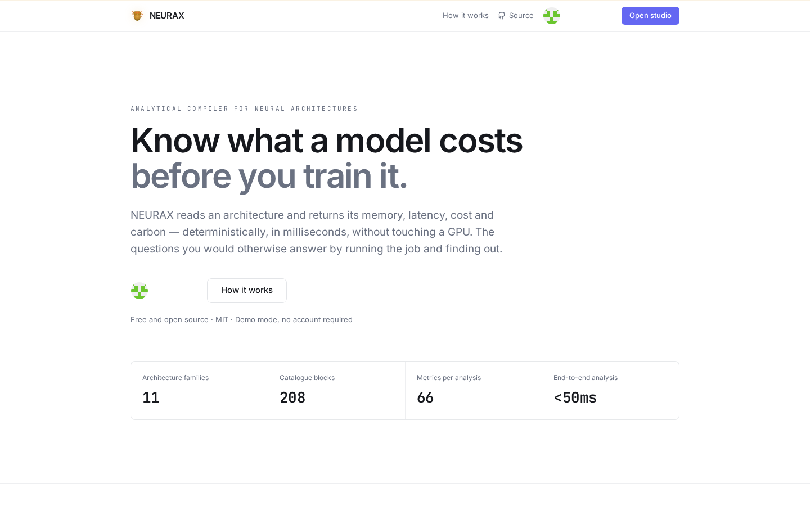
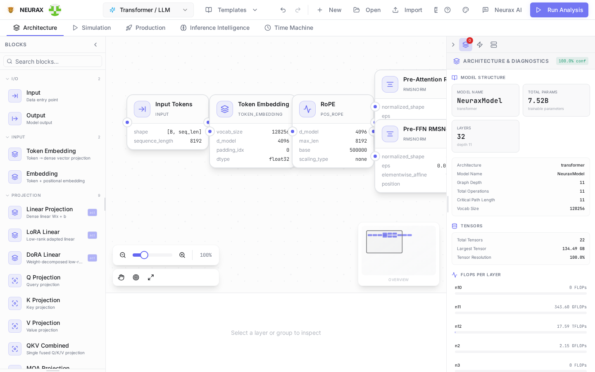
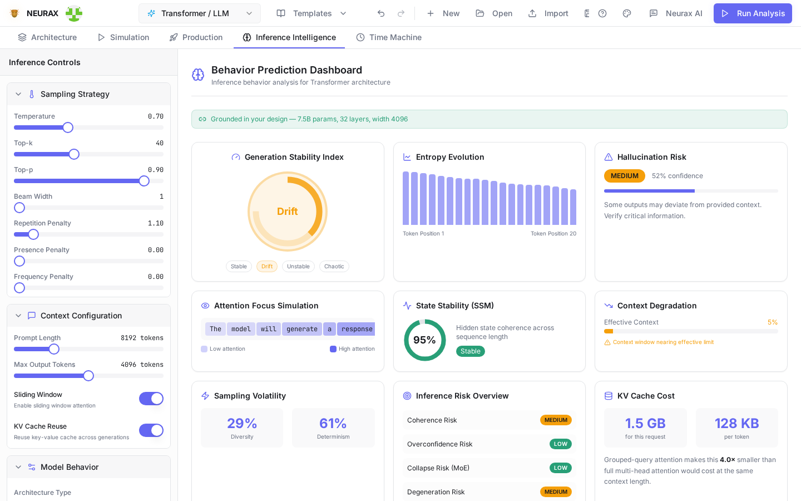
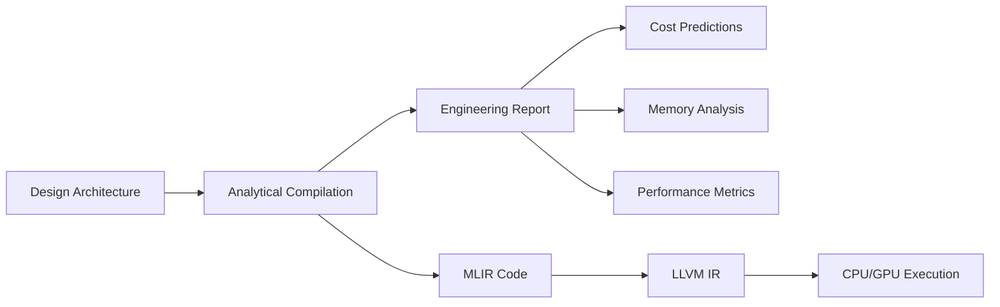
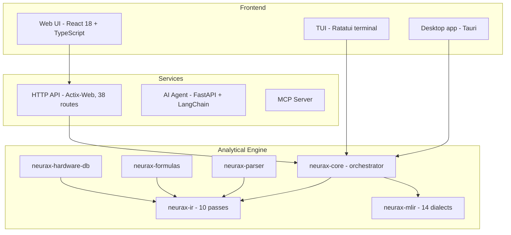

```mermaid
graph LR
    Input[model.json] --> P1[1. Architecture IR]
    P1 --> P2[2. Graph IR]
    P2 --> P3[3. Tensor IR]
    P3 --> P4[4. Operator IR]
    P4 --> P5[5. Compute IR]
    P5 --> P6[6. Memory IR]
    P6 --> P7[7. Parallelism IR]
    P7 --> P8[8. Hardware IR]
    P8 --> P9[9. Cost IR]
    P9 --> P10[10. Report IR]
    P10 --> Output[report.json]
```

# NEURAX

**Know what a model will cost — before you spend a single GPU-hour finding out.**

NEURAX reads a neural network architecture and gives you its memory, speed, and training cost in under 50 milliseconds, with no GPU and no training run. Point it at an idea, get real numbers back, decide whether it's worth building — before it costs you anything.

It isn't a research tool for people who already have a cluster. It's for anyone who wants to design a model — including a small, specialized one, tuned to your own dataset — and know upfront whether it fits on the hardware you actually have.

[Documentation](https://rustnew.github.io/NEURAX/) · [Releases](https://github.com/rustnew/NEURAX/releases) · [Contributing](CONTRIBUTING.md) · [Security](SECURITY.md)

[](https://github.com/rustnew/NEURAX/actions)
[](https://github.com/rustnew/NEURAX/releases)
[](LICENSE)
[](https://www.rust-lang.org)
[](https://mlir.llvm.org)
[](https://react.dev)

<p align="center">
  
</p>

---

## Install it and try it — one line, one minute

```bash
curl -fsSL https://raw.githubusercontent.com/rustnew/NEURAX/main/install.sh | sh
```

Then type `neurax` in a terminal, or open **NEURAX** from your applications menu.

That's the whole install: it detects your platform, downloads the right build, puts it under `~/.local`, adds a menu entry. No `sudo`, nothing written outside your home directory, nothing to sign up for. Works on **Debian, Ubuntu, Kali, Arch, Fedora, and effectively any Linux** (the installer is AppImage-first — no distro-specific packaging to get right), plus **macOS** (Intel and Apple silicon). See [*Every way to install it*](#every-way-to-install-it) below for `.deb`/`.rpm` downloads, pinning a version, Docker, and building from source.

This is not a claim taken on faith: while writing this README, a real run of `install.sh` on a Debian-family machine downloaded the app, installed it, and the resulting binary actually launched — embedded server up, real analysis served, clean shutdown. See *Install, verified* below.

**The desktop app is the reference way to use NEURAX** — the same studio as the web build, with the compiler running inside the app on your machine. No account, no upload, nothing sent anywhere. Open it, drag in a template or build from scratch, hit **Run Analysis**, done.

---

## What you get

<p align="center">
  
</p>

Drag blocks onto a canvas, or load one of 88 real reference architectures (GPT, LLaMA, Mixtral, Stable Diffusion, Mamba, and more), and NEURAX tells you — instantly, before any training run:

- **Will it fit?** Peak VRAM, activation memory, optimizer state, down to the byte.
- **What will it cost?** Training time, dollars, energy, CO₂ — on the GPU you actually have.
- **Where's the bottleneck?** FLOPs by operation, memory- vs. compute-bound, per layer.
- **Will it behave?** Inference stability, hallucination risk, attention focus — before you serve a single token.

<p align="center">
  
</p>

Every number on screen is computed from the architecture you built — not a lookup table, not an estimate copied from a paper. Change a block, re-run, watch the numbers move.

<p align="center">
  
</p>

### Built for a model that's actually yours

You don't need 80 GPUs or a research lab to use NEURAX. A 20M-parameter classifier for your own dataset, a small domain-specific transformer, an experiment you're not sure is worth training yet — NEURAX answers "will this work, and what will it cost" at that scale exactly as precisely as it does for a 70B model. Small and specialized is the common case, not the edge case.

### Accuracy, measured — not asserted

Every reference model is checked against its real, published parameter count by an automated test (`neurax-core/tests/published_model_accuracy.rs`), not eyeballed once and left to rot:

| Model | Published | NEURAX | Error |
|---|---|---|---|
| VGG-16 | 138.0 M | 138.4 M | +0.3 % |
| Mixtral 8x7B | 46.7 B | 47.4 B | +1.5 % |
| LLaMA-2 70B | 70.0 B | 68.7 B | −1.8 % |
| ResNet-50 | 25.6 M | 26.5 M | +3.5 % |
| RWKV 7B | 7.5 B | 7.2 B | −4.2 % |
| DeepSeek-V3 | 671 B | 701 B | +4.5 % |
| Mamba 2.8B | 2.80 B | 2.66 B | −4.9 % |

Four of these were wrong before that test existed — Mixtral by +122%, DeepSeek by +108%, RWKV by −96.7%, LLaMA-2 by −28.7% — because nothing anywhere compared a computed figure to a known one. That's the standard this project holds itself to: seven models measured, not every architecture that exists claimed.

### An AI copilot that designs with you — your key, your provider

Describe what you want in plain language — *"a small transformer for classifying support tickets"* — and NEURAX's copilot proposes and validates an architecture. Bring your own key for any of **7 providers**: OpenAI, Anthropic, Google (Gemini), Mistral, Fireworks AI, DeepSeek, GLM (Zhipu) — or point it at any OpenAI-compatible endpoint (a local Ollama/vLLM server, your own gateway). Every provider is tested end to end, not just assumed to work; your key stays in your browser and goes straight to the agent you're running, never to NEURAX's own infrastructure — because there isn't any in this path.

---

## Everything stays on your machine

- **Your account is a local profile** — a name, an avatar, an id, created automatically on first launch, kept in local storage. No identity server, nothing to sign up for, nothing that leaves the device.
- **Your API keys** are stored locally and sent directly to the agent process you're running — never to a NEURAX-operated server.
- **Your projects and designs** are kept on your machine (desktop) or in your own deployment (self-hosted) — never uploaded anywhere by the act of using the compiler.

This isn't a privacy footnote — it's the whole design. NEURAX doesn't need your data to work, so it never asks for it.

---

## Every way to install it

### Desktop application (recommended — see above)

| Distribution | What the installer uses |
|---|---|
| Debian, Ubuntu, Kali, Pop!\_OS, Mint, ... | `.AppImage` (tried first, no package manager needed), falling back to unpacking the `.deb` |
| Arch, Manjaro, EndeavourOS, ... | `.AppImage` — self-contained, no `pacman` involvement |
| Fedora, RHEL, openSUSE, ... | `.AppImage`, falling back to unpacking the `.rpm` |
| Any other Linux, or a container | `.AppImage` if FUSE is available; otherwise run it extracted (the installer tells you how) |
| macOS (Intel and Apple silicon) | The universal `.dmg`; the installer clears the quarantine flag so Gatekeeper doesn't block an unsigned build |

| | |
|---|---|
| Pin a version | `curl -fsSL … \| sh -s -- --version v0.8.0` |
| Install elsewhere | `curl -fsSL … \| sh -s -- --prefix ~/opt` |
| Remove it | `curl -fsSL … \| sh -s -- --uninstall` |

**Windows** has no packaged installer yet — run it from a checkout (see [`neurax-desktop/README.md`](neurax-desktop/README.md)) or use the web interface below.

To see exactly what the install script does before running it, it's a single readable POSIX shell script: [`install.sh`](install.sh).

#### Install, verified

Not assumed — checked, on the machine writing this: a real run of `install.sh` downloaded the AppImage, installed it under a custom prefix, correctly detected and left alone a pre-existing `neurax` binary from an older install method, and the installed application launched for real — embedded API server up, real requests served (`/projects`, `/credits`, `/inference/simulate`), clean shutdown on exit.

### Web interface

```bash
git clone https://github.com/rustnew/NEURAX.git
cd NEURAX
./start-dev.sh

# Web UI     -> http://localhost:8081
# API        -> http://localhost:9098
# Agent      -> http://localhost:8099
```

### Command line

There is no separate CLI crate. `neurax` is the application: the installer puts the desktop binary on your `PATH` under that name, and running it opens the window.

For analysis without a window — a build server, a pipeline — run the service and call it over HTTP:

```bash
cargo run -p neurax-service          # listens on 0.0.0.0:9098
curl -s localhost:9098/analyze \
  -H 'Content-Type: application/json' \
  -d "{\"topology\": $(cat examples/models/llama2_70b.json)}"
```

### As a Rust library

Depend on it as a path or git dependency:

```toml
[dependencies]
neurax-core = { git = "https://github.com/rustnew/NEURAX", package = "neurax-core" }
```

```rust
use neurax_core::analyze_json;

let result = analyze_json(model_json)?; // <50 ms, deterministic, no GPU
println!("{}", result.report_markdown);
```

### Docker

```bash
docker compose up -d
# Access at http://localhost:8081
```

---

## Architecture families

NEURAX ships 88 reference templates across 11 families — from a full GPT/LLaMA-class LLM down to a small classifier, the same compiler either way:

| Family | Examples |
|--------|----------|
| Transformer / LLM | GPT-2, LLaMA 2/3, BERT, Mistral 7B, Falcon 7B |
| Mixture-of-Experts | Mixtral, DeepSeek MoE, Qwen2-MoE, DBRX |
| CNN / Vision | ResNet, VGG, EfficientNet, MobileNetV2, ConvNeXt |
| State-Space Models | Mamba, Mamba2, ViM |
| Diffusion | DDPM, Stable Diffusion, Imagen, DALL-E 3, FLUX |
| GNN | GCN, GAT, GIN, GraphSAGE |
| GAN | DCGAN, StyleGAN, ProGAN, CycleGAN |
| Reinforcement Learning | DQN, PPO, SAC, A2C, TD3 |
| Spiking Neural Networks | LIF SNN, Spiking ResNet, Spikformer |
| RNN / LSTM / GRU | BiLSTM, LSTM Seq2Seq, GRU Seq2Seq |
| Experimental | Neural ODE, Liquid Time-Constant, Quantum Hybrid |

---

## How it works



NEURAX works like a compiler, but instead of compiling to machine code, it compiles to *understanding*: a 10-pass pipeline that turns the architecture you built into a full analytical report.



| Pass | Computed metrics |
|------|------------------|
| Architecture | Layer count, model type, global parameters |
| Graph | Topology validation, DAG structure, fan-in/fan-out |
| Tensor | Shape inference, dimension resolution, memory layout |
| Operator | FLOPs per op, parameter count, operation types |
| Compute | Total FLOPs, throughput, backward/optimizer overhead |
| Memory | Peak VRAM, activation/gradient memory, fragmentation |
| Parallelism | Tensor/pipeline/expert parallelism, efficiency scores |
| Hardware | GPU utilization, bandwidth, ridge point, latency |
| Cost | Training cost (USD), time (hours), energy (kWh), CO₂ (kg) |
| Report | Consolidated metrics, diagnostics, recommendations |

---

## Under the hood

NEURAX is a full-stack platform. **The desktop app is the reference build** — the same frontend, with the compiler embedded and running on a loopback socket, nothing else required.



| Component | Language | Purpose |
|-----------|----------|---------|
| **neurax-ui** | React 18 + TypeScript | Visual canvas, metrics dashboard, AI chat |
| **neurax-desktop** | Rust (Tauri) | The reference build — offline, compiler embedded |
| **neurax-service** | Rust (actix-web) | REST API, SSE streaming, auth |
| **neurax-agent** | Python (FastAPI + LangChain) | AI copilot: natural-language architecture planning |
| **neurax-core** | Rust | Pipeline orchestrator, ONNX export |
| **neurax-ir** | Rust | 10-pass analytical IR |
| **neurax-mlir** | Rust + MLIR | 14 custom dialects, LLVM 18 backend |
| **neurax-parser** | Rust | JSON schema → strongly-typed AST |
| **neurax-formulas** | Rust | Per-architecture analytical formulas |
| **neurax-hardware-db** | Rust | GPU/CPU specs |
| **neurax-tui** | Rust (Ratatui) | Terminal user interface |
| **neurax-mcp** | Python | Model Context Protocol server |

The Rust crates are workspace members, meant to be used together from a checkout or via a git dependency — see *As a Rust library* above.

### Repository layout

```
.
├── neurax-core/          # Pipeline orchestrator, ONNX export
├── neurax-ir/            # 10-pass analytical IR
├── neurax-mlir/          # 14 custom dialects, LLVM 18 backend
├── neurax-parser/        # JSON to strongly-typed AST
├── neurax-formulas/      # Analytical formulas
├── neurax-hardware-db/   # GPU/CPU spec database
├── neurax-tui/           # Terminal UI
├── neurax-service/       # Actix-web HTTP API (library + binary)
├── neurax-desktop/       # Tauri desktop app — the reference build
├── neurax-agent/         # Python AI copilot (FastAPI + LangChain)
├── neurax-mcp/           # MCP server
├── neurax-ui/            # React web frontend
├── book/                 # Documentation source (mdBook)
├── examples/models/      # Reference architecture configs
└── .github/workflows/    # CI (LLVM 18 / MLIR build, releases, docs)
```

---

## Documentation

The full documentation — architecture & design, API reference, deployment guide, changelog — is published at **https://rustnew.github.io/NEURAX/**, built from [`book/`](book/) with [mdBook](https://rust-lang.github.io/mdBook/).

| Document | Description |
|----------|-------------|
| [Architecture & Design](book/src/DESIGN.md) | System architecture, data flow, design principles |
| [API Reference](book/src/API_REFERENCE.md) | 38 REST endpoints, auth, schemas |
| [Deployment Guide](book/src/DEPLOYMENT.md) | Production and Docker deployment |
| [Changelog](CHANGELOG.md) | Version history |
| [Contributing](CONTRIBUTING.md) | Development workflow and code style |
| [Security](SECURITY.md) | Security policy and vulnerability reporting |

---

## Releases & versioning

NEURAX follows [Semantic Versioning](https://semver.org/). Releases are published on the [Releases page](https://github.com/rustnew/NEURAX/releases) and documented in the [CHANGELOG](CHANGELOG.md).

---

## Contributing

Contributions are welcome. See [CONTRIBUTING.md](CONTRIBUTING.md) for the development workflow, project layout, code style, and how to open a pull request.

---

## License

NEURAX is open-source software licensed under the **MIT License**. See [LICENSE](LICENSE) for the full text.

---

## Acknowledgments

NEURAX builds on:

- **MLIR** / **LLVM** — compiler infrastructure
- **Rust** — systems programming language
- **React** — UI framework
- **shadcn/ui** — component library
- **Tauri** — desktop application shell
- **LangChain** — the AI agent's provider orchestration

---

Built by Fossouo.
