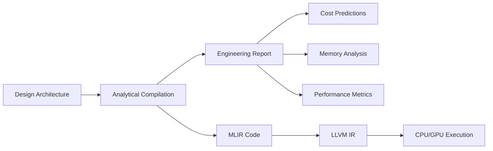
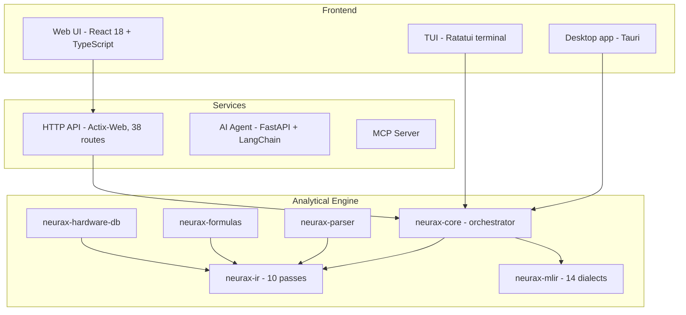

```mermaid
graph LR
    Input[model.json] --> P1[1. Architecture IR]
    P1 --> P2[2. Graph IR]
    P2 --> P3[3. Tensor IR]
    P3 --> P4[4. Operator IR]
    P4 --> P5[5. Compute IR]
    P5 --> P6[6. Memory IR]
    P6 --> P7[7. Parallelism IR]
    P7 --> P8[8. Hardware IR]
    P8 --> P9[9. Cost IR]
    P9 --> P10[10. Report IR]
    P10 --> Output[report.json]
```

# NEURAX

**The Analytical Compiler for Neural Architectures**

NEURAX predicts the **cost, memory, and performance** of a neural network architecture **before training** — in under 50 ms, with zero GPU, and fully deterministically.

[Documentation](https://rustnew.github.io/NEURAX/) · [Releases](https://github.com/rustnew/NEURAX/releases) · [Contributing](CONTRIBUTING.md) · [Security](SECURITY.md)

[](https://github.com/rustnew/NEURAX/actions)
[](https://github.com/rustnew/NEURAX/releases)
[](LICENSE)
[](https://www.rust-lang.org)
[](https://mlir.llvm.org)
[](https://react.dev)

---

## Overview

NEURAX is an **analytical compiler** for neural network architectures. Where training frameworks (PyTorch, TensorFlow) execute models and runtime compilers (IREE, OpenXLA) lower them for execution, NEURAX operates at **design time**: it answers the questions you'd otherwise need a training run — and a GPU bill — to find out.

- Will this architecture fit in VRAM?
- What is the training cost on 8× H100?
- Where are the memory bottlenecks?
- Is inference stable? What is the hallucination risk?
- Which parallelism strategy is optimal?

All in under 50 ms. Zero GPU required. Fully deterministic — the same input always produces the same output.

---

## Key capabilities

### Universal architecture support
- **11 architecture families** — Transformer, CNN, MoE, SSM, Diffusion, GNN, GAN, RL, SNN, RNN, Experimental.
- **208 configurable blocks** — attention, MLP, conv, embedding, normalization, and more.
- **88 reference templates** — from GPT-style LLMs to Stable Diffusion, ready to load and modify.

Both counts are enforced by a test that checks them against the real block
catalogue on every build (`projectFacts.test.ts`) — not written down once and
left to drift.

### Accuracy, measured against reality
Every reference model is checked against its published parameter count by
`neurax-core/tests/published_model_accuracy.rs`:

| Model | Published | NEURAX | Error |
|---|---|---|---|
| VGG-16 | 138.0 M | 138.4 M | +0.3 % |
| Mixtral 8x7B | 46.7 B | 47.4 B | +1.5 % |
| LLaMA-2 70B | 70.0 B | 68.7 B | −1.8 % |
| ResNet-50 | 25.6 M | 26.5 M | +3.5 % |
| RWKV 7B | 7.5 B | 7.2 B | −4.2 % |
| DeepSeek-V3 | 671 B | 701 B | +4.5 % |
| Mamba 2.8B | 2.80 B | 2.66 B | −4.9 % |

Four of these were wrong before that test existed — Mixtral by +122%,
DeepSeek by +108%, RWKV by −96.7%, LLaMA-2 by −28.7% — because nothing
anywhere compared a computed figure to a known one. Mixture-of-Experts models
specifically had a second, independent bug (a router/expert-combine
decomposition that mis-costed the router, compounded by a depth-scaling pass
that diluted per-layer costs) — fixed and now covered by both a mechanical
unit test and a live-compiler integration test against Mixtral and
DeepSeek-MoE. A 1.42-trillion-parameter configuration is also checked, to
catch arithmetic that wraps at that scale.

Seven models is what is measured. It is not a claim about every architecture
that exists.

### Instant analytical compilation
- **<50 ms analysis** — the full 10-pass IR pipeline on 8B-parameter models.
- **66 metrics** — FLOPs, VRAM, latency, cost, energy, carbon emissions.
- **Active vs. total parameters** — for Mixture-of-Experts models, both the
  full parameter count and the fraction actually touched per token.
- **Deterministic** — no sampling, no GPU, runs the same in a browser tab and
  on a CI runner.

### Visual design canvas
- Drag-and-drop architecture builder across all 208 blocks.
- Real-time validation of connections and parameters.
- **Import directly from the HuggingFace Hub** — paste a model ID
  (`mistralai/Mistral-7B-v0.1`) or its page URL and NEURAX fetches
  `config.json` straight from `huggingface.co` and compiles it; no manual
  copy-paste round trip.
- Export to JSON, NEURAX IR, or a GitHub commit. There used to be four more
  targets (PyTorch, ONNX, Triton, Rust/Burn); their generated code didn't
  actually run, so they were removed rather than left to mislead anyone who
  tried them.

### AI copilot agent
- Natural-language design — "Create a transformer for image classification".
- **Seven providers, bring your own key**: OpenAI, Anthropic, Google
  (Gemini), Mistral, Fireworks AI, DeepSeek, GLM (Zhipu) — plus any
  OpenAI-compatible custom endpoint (a local vLLM/Ollama server, a corporate
  gateway). Every provider is covered by tests that construct its real
  client and check it reaches its own endpoint, not another provider's.
- Your key is stored in your browser's local storage and sent directly to
  the agent you're running (locally, or one you deployed) — never to
  NEURAX's own infrastructure, because there isn't any in this path.
- Auto-validation of topology with optimization suggestions.

### Inference Intelligence
- 22 configurable parameters — sampling, context, model behavior, stress testing.
- 10 analytical widgets — stability, entropy, hallucination risk, attention focus.
- Predict inference behavior before serving, not after.

### Time Machine
- Multi-year cost, carbon, and scaling projections (3–5 years).
- Regulatory tracking — EU AI Act, CSRD, DSA.
- Hardware migration planning with real specs.

---

## How it works



### The 10-pass IR pipeline



| Pass | Computed metrics |
|------|------------------|
| Architecture | Layer count, model type, global parameters |
| Graph | Topology validation, DAG structure, fan-in/fan-out |
| Tensor | Shape inference, dimension resolution, memory layout |
| Operator | FLOPs per op, parameter count, operation types |
| Compute | Total FLOPs, throughput, backward/optimizer overhead |
| Memory | Peak VRAM, activation/gradient memory, fragmentation |
| Parallelism | Tensor/pipeline/expert parallelism, efficiency scores |
| Hardware | GPU utilization, bandwidth, ridge point, latency |
| Cost | Training cost (USD), time (hours), energy (kWh), CO₂ (kg) |
| Report | Consolidated metrics, diagnostics, recommendations |

---

## Architecture

NEURAX is a full-stack platform with several integrated surfaces:



### Component breakdown

| Component | Language | Purpose |
|-----------|----------|---------|
| **neurax-ui** | React 18 + TypeScript | Visual canvas, metrics dashboard, AI chat |
| **neurax-desktop** | Rust (Tauri) | Offline desktop app — same UI, compiler embedded |
| **neurax-service** | Rust (actix-web) | REST API, SSE streaming, auth |
| **neurax-agent** | Python (FastAPI + LangChain) | AI copilot: natural-language architecture planning |
| **neurax-core** | Rust | Pipeline orchestrator, ONNX export |
| **neurax-ir** | Rust | 10-pass analytical IR |
| **neurax-mlir** | Rust + MLIR | 14 custom dialects, LLVM 18 backend |
| **neurax-parser** | Rust | JSON schema → strongly-typed AST |
| **neurax-formulas** | Rust | Per-architecture analytical formulas |
| **neurax-hardware-db** | Rust | GPU/CPU specs |
| **neurax-tui** | Rust (Ratatui) | Terminal user interface |
| **neurax-mcp** | Python | Model Context Protocol server |

The Rust crates are workspace members, meant to be used together from a
checkout or via a git dependency — see *As a Rust library* below.

---

## Repository layout

```
.
├── neurax-core/          # Pipeline orchestrator, ONNX export
├── neurax-ir/            # 10-pass analytical IR
├── neurax-mlir/          # 14 custom dialects, LLVM 18 backend
├── neurax-parser/        # JSON to strongly-typed AST
├── neurax-formulas/      # Analytical formulas
├── neurax-hardware-db/   # GPU/CPU spec database
├── neurax-tui/           # Terminal UI
├── neurax-service/       # Actix-web HTTP API (library + binary)
├── neurax-desktop/       # Tauri desktop app — the studio, offline
├── neurax-agent/         # Python AI copilot (FastAPI + LangChain)
├── neurax-mcp/           # MCP server
├── neurax-ui/            # React web frontend
├── book/                 # Documentation source (mdBook)
├── examples/models/      # Reference architecture configs
└── .github/workflows/    # CI (LLVM 18 / MLIR build, releases, docs)
```

---

## Getting started

### Desktop application (recommended)

**Linux and macOS — one command:**

```bash
curl -fsSL https://raw.githubusercontent.com/rustnew/NEURAX/main/install.sh | sh
```

Then type `neurax` in a terminal, or open **NEURAX** from your applications
menu.

That is all it does: detect your platform, download the right bundle from
the newest release that has one, put it under `~/.local`, and add an entry
to your applications menu. Nothing is written outside your home directory
and no step asks for `sudo`. To see it before running it, read
[`install.sh`](install.sh) — it's a single readable POSIX shell script,
tested against `dash` (Debian's `/bin/sh`) as well as `bash` and `zsh`.

This was verified end to end while writing this README — not assumed: a
real run of `install.sh` on a Debian-family Linux machine downloaded the
AppImage, installed it, added the menu entry, correctly detected and left
alone a pre-existing `neurax` binary from an older install method, and the
resulting application launched, started its embedded API server, and served
real requests.

| Distribution | What the installer uses |
|---|---|
| Debian, Ubuntu, Kali, Pop!\_OS, Mint, ... | `.AppImage` (tried first, no package manager needed), falling back to unpacking the `.deb` |
| Arch, Manjaro, EndeavourOS, ... | `.AppImage` — self-contained, no `pacman` involvement |
| Fedora, RHEL, openSUSE, ... | `.AppImage`, falling back to unpacking the `.rpm` |
| Any other Linux, or a container | `.AppImage` if FUSE is available; otherwise run it extracted (the installer tells you how) |
| macOS (Intel and Apple silicon) | The universal `.dmg`; the installer clears the quarantine flag so Gatekeeper doesn't block an unsigned build |

| | |
|---|---|
| Pin a version | `curl -fsSL … \| sh -s -- --version v0.8.0` |
| Install elsewhere | `curl -fsSL … \| sh -s -- --prefix ~/opt` |
| Remove it | `curl -fsSL … \| sh -s -- --uninstall` |

**Windows** has no packaged installer yet — no `.exe`/`.msi` is currently
built or published. On Windows, run it from a checkout (see *Building the
desktop app* below) or use the web interface.

**What you get.** The same studio as the web application — same panels,
same analyses, same numbers — with the compiler running inside the
application on a loopback socket. Projects are kept on your machine and are
still there next time you open it; the account is a local profile (see
*Privacy* below), so the desktop build makes no network call the analysis
itself depends on.

Building it from source, and how it's put together, is in
[`neurax-desktop/README.md`](neurax-desktop/README.md).

### Web interface

```bash
git clone https://github.com/rustnew/NEURAX.git
cd NEURAX
./start-dev.sh

# Web UI     -> http://localhost:8081
# API        -> http://localhost:9098
# Agent      -> http://localhost:8099
```

### Command line

There is no separate CLI crate. `neurax` is the application: the installer
puts the desktop binary on your `PATH` under that name, and running it opens
the window.

For analysis without a window — a build server, a pipeline — run the
service and call it over HTTP:

```bash
cargo run -p neurax-service          # listens on 0.0.0.0:9098
curl -s localhost:9098/analyze \
  -H 'Content-Type: application/json' \
  -d "{\"topology\": $(cat examples/models/llama2_70b.json)}"
```

Or use the crates directly from a checkout — see *As a Rust library* below.

### As a Rust library

Depend on it as a path or git dependency:

```toml
[dependencies]
neurax-core = { git = "https://github.com/rustnew/NEURAX", package = "neurax-core" }
```

```rust
use neurax_core::analyze_json;

let result = analyze_json(model_json)?; // <50 ms, deterministic, no GPU
println!("{}", result.report_markdown);
```

### Docker

```bash
docker compose up -d
# Access at http://localhost:8081
```

---

## Architecture families

NEURAX ships 88 reference templates across 11 families:

| Family | Examples |
|--------|----------|
| Transformer / LLM | GPT-2, LLaMA 2/3, BERT, Mistral 7B, Falcon 7B |
| Mixture-of-Experts | Mixtral, DeepSeek MoE, Qwen2-MoE, DBRX |
| CNN / Vision | ResNet, VGG, EfficientNet, MobileNetV2, ConvNeXt |
| State-Space Models | Mamba, Mamba2, ViM |
| Diffusion | DDPM, Stable Diffusion, Imagen, DALL-E 3, FLUX |
| GNN | GCN, GAT, GIN, GraphSAGE |
| GAN | DCGAN, StyleGAN, ProGAN, CycleGAN |
| Reinforcement Learning | DQN, PPO, SAC, A2C, TD3 |
| Spiking Neural Networks | LIF SNN, Spiking ResNet, Spikformer |
| RNN / LSTM / GRU | BiLSTM, LSTM Seq2Seq, GRU Seq2Seq |
| Experimental | Neural ODE, Liquid Time-Constant, Quantum Hybrid |

---

## AI providers

The copilot agent (`neurax-agent`) is bring-your-own-key: NEURAX never holds
or bills against your API key. Enter it once in Account settings and it's
kept in your browser's local storage.

| Provider | How it's reached |
|---|---|
| OpenAI | Native API |
| Anthropic (Claude) | Native API — also accepts a gateway/proxy `base_url` |
| Google (Gemini) | Native API — a separate client, since Gemini's API isn't OpenAI-shaped |
| Mistral | OpenAI-compatible endpoint |
| Fireworks AI | OpenAI-compatible endpoint |
| DeepSeek | OpenAI-compatible endpoint |
| GLM (Zhipu) | OpenAI-compatible endpoint |
| Custom | Any OpenAI-compatible server — a local vLLM/Ollama instance, a corporate gateway |

Every provider is exercised by a test that builds its real client and
asserts it reaches its own default endpoint with its own key — the specific
regression this guards against is a provider silently falling through to a
different one's endpoint and failing authentication on every call, which
happened historically for Google and for every non-OpenAI provider before
each had an explicit path.

---

## Privacy

- **Your account is a local profile** — a name, an avatar, and an id,
  created automatically on first launch and kept in this browser's (or, on
  desktop, this machine's) storage. There's no identity server behind it, no
  project to set up, and nothing about it is ever sent anywhere.
- **API keys** live in your browser's local storage and are sent directly to
  the agent process you're running — never to a NEURAX-operated server,
  because there isn't one in this path.
- **Projects and designs** are kept on your machine (the desktop app) or in
  your own deployment's storage — not uploaded anywhere by the act of using
  the compiler.

---

## Documentation

The full documentation — architecture & design, API reference, deployment
guide, changelog — is published at **https://rustnew.github.io/NEURAX/**,
built from [`book/`](book/) with [mdBook](https://rust-lang.github.io/mdBook/).

| Document | Description |
|----------|-------------|
| [Architecture & Design](book/src/DESIGN.md) | System architecture, data flow, design principles |
| [API Reference](book/src/API_REFERENCE.md) | 38 REST endpoints, auth, schemas |
| [Deployment Guide](book/src/DEPLOYMENT.md) | Production and Docker deployment |
| [Changelog](CHANGELOG.md) | Version history |
| [Contributing](CONTRIBUTING.md) | Development workflow and code style |
| [Security](SECURITY.md) | Security policy and vulnerability reporting |

---

## Releases & versioning

NEURAX follows [Semantic Versioning](https://semver.org/). Releases are
published on the [Releases page](https://github.com/rustnew/NEURAX/releases)
and documented in the [CHANGELOG](CHANGELOG.md).

---

## Contributing

Contributions are welcome. See [CONTRIBUTING.md](CONTRIBUTING.md) for the
development workflow, project layout, code style, and how to open a pull
request.

---

## License

NEURAX is open-source software licensed under the **MIT License**. See
[LICENSE](LICENSE) for the full text.

---

## Acknowledgments

NEURAX builds on:

- **MLIR** / **LLVM** — compiler infrastructure
- **Rust** — systems programming language
- **React** — UI framework
- **shadcn/ui** — component library
- **Tauri** — desktop application shell
- **LangChain** — the AI agent's provider orchestration

---

Built by Fossouo.
