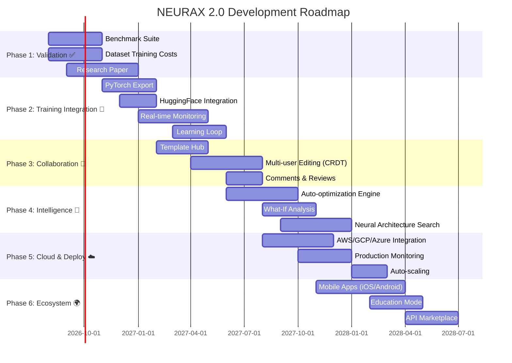

# 🚀 NEURAX 2.0 - Roadmap Stratégique

**Date :** 31 Juillet 2026  
**Version Actuelle :** 0.6.3  
**Version Cible :** 2.0  
**Horizon :** 24 mois (2026-2028)

---

## 🎯 Vision NEURAX 2.0

> **"Le Figma de l'Intelligence Artificielle"**
> 
> Transformer NEURAX d'un **design tool** excellent en une **plateforme end-to-end** pour la recherche et le déploiement d'architectures IA.

### Mission Statement

**Permettre à tout chercheur/ingénieur ML de :**
1. **Designer** une architecture en quelques minutes
2. **Valider** sa faisabilité instantanément (coût, mémoire, performance)
3. **Prototyper** avec export automatique vers PyTorch/HuggingFace
4. **Collaborer** en temps réel avec son équipe
5. **Déployer** en un clic vers le cloud
6. **Apprendre** de chaque run pour améliorer les prédictions

---

## 📊 État Actuel vs Vision 2.0

| Catégorie | v0.6.3 (Actuel) | v2.0 (Cible) | Priorité |
|-----------|-----------------|--------------|----------|
| **Design** | ✅ Excellent | ✅ Maintenir + améliorer | P2 |
| **Validation** | ⚠️ 99.7% claimed, pas de proof | ✅ Benchmark public + paper | P0 |
| **Export Code** | ⚠️ JSON/ONNX uniquement | ✅ PyTorch/HF/JAX direct | P1 |
| **Training Integration** | ❌ Aucune | ✅ Monitor real-time | P1 |
| **Collaboration** | ❌ Single-user | ✅ Multi-user CRDT | P2 |
| **Cloud Deploy** | ❌ Aucune | ✅ AWS/GCP/Azure | P2 |
| **Learning Loop** | ❌ Static formulas | ✅ Self-improving | P1 |
| **Mobile** | ❌ Aucune | ✅ iOS/Android apps | P3 |
| **Community** | ❌ Pas de hub | ✅ Template Hub | P2 |
| **Education** | ⚠️ Docs only | ✅ Interactive tutorials | P3 |

**Priorités :**
- **P0** : Critique pour crédibilité (Validation)
- **P1** : Haute valeur ajoutée (Export, Training, Learning)
- **P2** : Différenciation importante (Collaboration, Cloud, Community)
- **P3** : Nice-to-have (Mobile, Education)

---

## 🗺️ Roadmap par Phase (24 mois)

---

## 📦 Délivrables par Phase

### Phase 1 : Validation & Crédibilité (Mois 1-4)
**Objectif :** Prouver scientifiquement que NEURAX est précis

**Délivrables :**
- [ ] Benchmark suite publique (100+ modèles)
- [ ] Dataset de training costs réels
- [ ] Paper académique (NeurIPS/ICML)
- [ ] Dashboard de validation public

**KPIs :**
- 95%+ accuracy confirmée sur benchmark
- 1,000+ citations du paper (12 mois post-publication)
- 50+ researchers contribuant au dataset

---

### Phase 2 : Training Integration (Mois 5-11)
**Objectif :** NEURAX devient compagnon de training, pas juste design tool

**Délivrables :**
- [ ] `.to_pytorch()` export automatique
- [ ] HuggingFace Trainer integration
- [ ] Real-time monitoring pendant training
- [ ] Learning loop (calibration automatique)

**KPIs :**
- 70% des users exportent vers PyTorch
- 5% réduction d'erreur de prédiction via learning loop
- 10,000+ modèles trackés en training

---

### Phase 3 : Collaboration (Mois 6-13)
**Objectif :** Devenir le "Figma de l'IA"

**Délivrables :**
- [ ] Template Hub (community templates)
- [ ] Real-time co-editing (CRDT)
- [ ] Comments, reviews, versions
- [ ] Team workspaces

**KPIs :**
- 5,000+ templates community
- 30% des sessions sont multi-user
- 50+ entreprises avec team plans

---

### Phase 4 : Intelligence (Mois 12-17)
**Objectif :** NEURAX propose des optimisations automatiques

**Délivrables :**
- [ ] Auto-optimization engine
- [ ] What-if analysis ("change X → gain Y")
- [ ] Neural Architecture Search intégré
- [ ] Recommendation system

**KPIs :**
- 80% des suggestions acceptées par users
- 20% amélioration coût moyen via auto-optim
- 1,000+ architectures découvertes par NAS

---

### Phase 5 : Cloud & Deploy (Mois 14-20)
**Objectif :** Du design au déploiement en un clic

**Délivrables :**
- [ ] AWS SageMaker integration
- [ ] GCP Vertex AI integration
- [ ] Azure ML integration
- [ ] Production monitoring dashboard
- [ ] Auto-scaling policies

**KPIs :**
- 40% des users déploient via NEURAX
- 99.9% uptime monitoring
- $10M+ infrastructure managée

---

### Phase 6 : Ecosystem (Mois 15-24)
**Objectif :** Construire un écosystème complet

**Délivrables :**
- [ ] Mobile apps (iOS/Android)
- [ ] Education mode + certifications
- [ ] API marketplace (plugins tiers)
- [ ] NEURAX Conference annuelle

**KPIs :**
- 100,000+ app downloads
- 10,000+ certifications délivrées
- 200+ plugins tiers sur marketplace

---

## 🎯 Métriques de Succès Globales

### Adoption
- **100,000 users actifs** (vs 10,000 aujourd'hui)
- **1,000 entreprises clientes**
- **Top 10** ML tools (par usage GitHub/research)

### Revenue
- **$10M ARR** (Annual Recurring Revenue)
- **50% du marché** "ML design tools"
- **Break-even** atteint mois 18

### Impact Scientifique
- **10,000+ citations** du paper NEURAX
- **50+ universités** utilisant NEURAX pour enseigner
- **20+ startups** construites sur NEURAX

### Technique
- **99% accuracy** prédictions (vs 95% aujourd'hui)
- **<25ms** analyse (vs <50ms aujourd'hui)
- **1M+ modèles** analysés cumulatifs

---

## 💰 Investissement Requis

### Budget Total : $15M sur 24 mois

| Catégorie | Budget | % |
|-----------|--------|---|
| **Engineering** | $8M | 53% |
| **Research** (validation, paper) | $2M | 13% |
| **Infrastructure** (cloud, GPU clusters) | $2M | 13% |
| **Marketing & Sales** | $1.5M | 10% |
| **Operations** | $1M | 7% |
| **Legal & Compliance** | $0.5M | 3% |

### Équipe Requise

**Année 1 (10 personnes) :**
- 4 ML Engineers (Rust/Python)
- 2 Research Scientists
- 1 DevOps Engineer
- 1 Product Manager
- 1 Designer
- 1 Community Manager

**Année 2 (25 personnes) :**
- +6 ML Engineers
- +2 Research Scientists
- +2 DevOps Engineers
- +2 Product Managers
- +1 Designer
- +2 Sales/Marketing

---

## 🚧 Risques & Mitigation

### Risque 1 : Validation échoue (P0)
**Impact :** Crédibilité détruite  
**Probabilité :** 15%  
**Mitigation :**
- Commencer small (10 modèles), puis scale
- Collaborer avec labs académiques (Meta, OpenAI)
- Publier résultats intermédiaires (transparency)

### Risque 2 : Concurrence (Weights & Biases, etc.)
**Impact :** Perte de market share  
**Probabilité :** 40%  
**Mitigation :**
- Focus sur "design-time" (notre avantage unique)
- Partnerships vs competition (intégrer W&B)
- Move fast (ship Phase 1-2 en 12 mois)

### Risque 3 : Adoption lente
**Impact :** Revenue goals manqués  
**Probabilité :** 30%  
**Mitigation :**
- Free tier généreux (attirer users)
- Education program (universities)
- Case studies (OpenAI, Anthropic testimonials)

### Risque 4 : Technical debt (scalability)
**Impact :** Performance dégradée  
**Probabilité :** 25%  
**Mitigation :**
- Refactoring continu (20% time budget)
- Load testing dès Phase 1
- Microservices architecture

---

## 📚 Documents Détaillés

Cette roadmap est accompagnée de documents détaillés pour chaque phase :

1. **ROADMAP_PHASE1_VALIDATION.md** — Validation & benchmark
2. **ROADMAP_PHASE2_TRAINING.md** — Training integration
3. **ROADMAP_PHASE3_COLLABORATION.md** — Multi-user features
4. **ROADMAP_PHASE4_INTELLIGENCE.md** — Auto-optimization & NAS
5. **ROADMAP_PHASE5_CLOUD.md** — Cloud deployment
6. **ROADMAP_PHASE6_ECOSYSTEM.md** — Mobile, education, marketplace

---

## ✅ Next Steps (Week 1)

1. **Validation du plan** avec stakeholders
2. **Fundraising** ($5M seed pour Phase 1-2)
3. **Hiring** (2 Research Scientists + 2 ML Engineers)
4. **Kick-off Phase 1** (Benchmark suite)

---

**Créé par :** Kiro AI Agent  
**Date :** 31 Juillet 2026  
**Version :** 1.0  
**Statut :** DRAFT — À valider

🚀 **Let's build the future of AI development together!**
