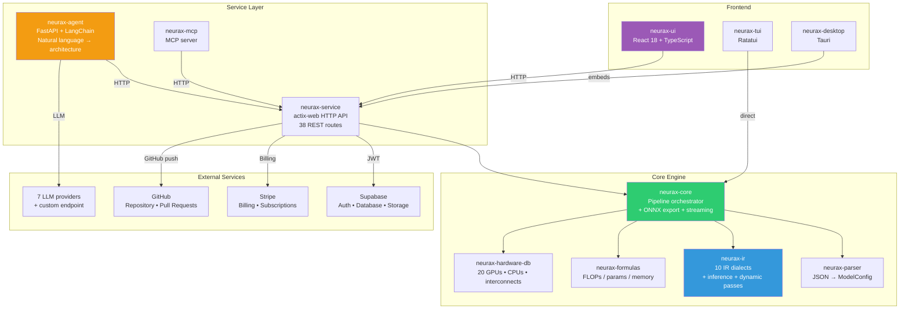
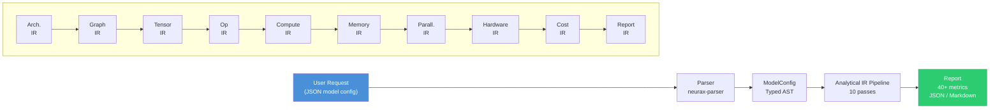

# NEURAX Architecture Design

This document describes the architecture, design principles, and data flow of the NEURAX compiler system.

---

## Table of Contents

1. [Overview](#overview)
2. [System Architecture](#system-architecture)
3. [Data Flow](#data-flow)
4. [Component Deep Dive](#component-deep-dive)
5. [Design Principles](#design-principles)
6. [Adding a New Model Family](#adding-a-new-model-family)

---

## Overview

NEURAX is an **analytical compiler** for neural network architectures. Unlike traditional compilers that emit machine code, NEURAX emits a complete **engineering report** of a model's behaviour on target hardware — cost, memory, speed, safety, and feasibility — **in milliseconds**, before a single GPU spins up.

The system is composed of:

| Component | Language | Port | Purpose |
|---|---|---|---|
| `neurax-service` | Rust (actix-web) | 9098 | HTTP API: analysis, export, billing, projects |
| `neurax-ui` | TypeScript (React 18) | 8081 | Visual web frontend |
| `neurax-agent` | Python (FastAPI) | 8099 | AI copilot for architecture design |
| `neurax-mcp` | Python | stdio | Model Context Protocol server |
| `neurax-tui` | Rust (Ratatui) | — | Terminal user interface |
| `neurax-desktop` | Rust (Tauri) | — | Desktop app — the compiler and UI, running locally, no account or network needed |

---

## System Architecture



---

## Data Flow

The primary data flow for architecture analysis:



### The 10-Pass IR Pipeline

Each pass transforms the representation and computes metrics:

| Pass | IR Dialect | Input | Output | Key Metrics |
|---|---|---|---|---|
| 1 | ArchitectureIR | ModelConfig | ArchitectureIR | Layer count, model type, global params |
| 2 | GraphIR | ArchitectureIR | GraphIR | Graph topology, DAG validation, fan-in/fan-out |
| 3 | TensorIR | GraphIR | TensorIR | Tensor shapes, dimension resolution, memory layout |
| 4 | OperatorIR | TensorIR | OperatorIR | Operator types, FLOPs per operator, param count |
| 5 | ComputeIR | OperatorIR | ComputeIR | Total FLOPs, FLOPs breakdown, backward/optimizer overhead |
| 6 | MemoryIR | ComputeIR | MemoryIR | Peak VRAM, activation memory, gradient memory, fragmentation |
| 7 | ParallelismIR | MemoryIR | ParallelismIR | Tensor/pipeline/expert parallelism, efficiency |
| 8 | HardwareIR | ComputeIR+MemoryIR+ParallelismIR | HardwareIR | GPU utilization, bandwidth, ridge point, latency |
| 9 | CostIR | HardwareIR+ParallelismIR | CostIR | Training cost USD, time hours, energy kWh, CO2 kg |
| 10 | ReportIR | All above | ReportIR | Consolidated report with 40+ metrics, diagnostics, recommendations |

### Dynamic Analysis (Parallel, Post-Pipeline)

Three dynamic passes run in parallel after the static pipeline:

| Pass | Focus | Output |
|---|---|---|
| VirtualMemoryPass | Memory fragmentation, virtualization savings | Allocation strategy, savings estimate |
| StabilityAnalysisPass | Training stability via Lyapunov exponents | Stability index, risk level |
| BehavioralSynthesisPass | Runtime behavior inference (MoE imbalance, cache locality) | Behavioral metrics |

---

## Component Deep Dive

### neurax-parser

The parser ingests JSON model configurations conforming to the NEURAX universal schema (v1.0) and produces a strongly-typed `ModelConfig`.

**Key types**:
- `ModelConfig` — top-level configuration (model, training, hardware, parallelism)
- `ModelType` enum — Transformer, CNN, MoE, SSM, Diffusion, GNN, GAN, RL, SNN, RNN, Multimodal, Custom
- `LayerType` enum — Attention, Mlp, Embedding, Conv2d, etc.
- Schema validation via `ModelValidator`

**Supported model types**: transformer, cnn, moe, ssm, diffusion, gnn, gan, rl, snn, rnn, multimodal, custom

### neurax-ir

The IR crate implements 10 dialect-like modules, each with its own `Pass` struct implementing the `IrPass` trait:

```rust
pub trait IrPass {
    type Input;
    type Output;
    type Metrics;

    fn build(&self, input: &Self::Input, ctx: &NeuraxContext) -> Result<Self::Output, NeuraxError>;
    fn compute_metrics(&self, output: &mut Self::Output, ctx: &NeuraxContext) -> Result<Self::Metrics, NeuraxError>;
    fn validate(&self, output: &Self::Output, metrics: &Self::Metrics) -> Result<(), NeuraxError>;
}
```

**Diagnostic system**: Standardized diagnostic codes (E001-E005 errors, W001-W006 warnings, I001-I003 info, H001-H005 hints) with severity levels and precision impact scoring.

### neurax-core

The orchestrator that wires together the 10-pass pipeline, dynamic analysis, and export. Also provides:
- `run_analysis()` — full pipeline entry point
- `analyze_json()` — JSON string → AnalysisResult
- `validate_json()` — JSON validation
- `get_model_summary()` — quick model summary
- ONNX export via `neurax-core/src/export/`

### neurax-mlir

MLIR compiler backend with 14 custom dialects, callable as a library
(`compile_model_to_mlir`) and covered by its own 119 tests.

**Not part of the request path above.** Nothing in `neurax-service` or
`neurax-core` calls into this crate — the diagrams in this document used to
show it wired into the live pipeline, feeding LLVM 18/IREE for CPU, CUDA,
Vulkan, Metal and ROCm targets, which described a lowering pipeline that
doesn't run. What actually produces every metric a user sees is the
10-pass analytical IR pipeline above (`neurax-ir` + `neurax-formulas`).
`neurax-mlir` is real, working code — reachable by depending on the crate
directly, see `examples/compile_to_mlir.rs` — that emits textual MLIR from
the same parsed `ModelConfig`, using the same real per-layer formulas as
the analytical pipeline (`neurax_ir::calculate_layer_params`,
`neurax_ir::layer_flops`) rather than the standalone approximation it used
to keep. Lowering that MLIR the rest of the way to LLVM IR, an object
file, or any of the target backends below is not wired up to anything —
the dialects and target-specific codegen modules exist, but nothing in
the shipped product calls them today.

| Dialect | Purpose |
|---|---|
| Architecture | Model structure (model, layers, global params) |
| Graph | Computation graph topology |
| Tensor | Tensor shapes and memory layout |
| Operator | Operator-level operations (attention, MLP, conv) |
| Compute | Compute characteristics (FLOPs, throughput) |
| Memory | Memory operations (allocations, copies) |
| Parallelism | Parallelism strategies (TP, PP, DP, EP) |
| Hardware | Hardware specifications and constraints |
| Cost | Cost model operations |
| Report | Report generation operations |
| Training | Training-specific operations |
| Data | Data pipeline operations |
| Optimization | Optimization pass operations |
| Utils | Shared helpers used across the other dialects |

**Target backend code that exists but nothing calls**: CPU, CUDA, Vulkan, Metal, ROCm codegen modules, plus IREE integration — implemented, tested in isolation, not reachable from an analysis request.

### neurax-formulas

Pure analytical formulas for ML operations. Hot path — maximum optimization.

**Modules**: attention, conv, mlp, embedding, normalization, moe, ssm, rnn, diffusion, gnn, custom, cnn_blocks.

### neurax-hardware-db

Built-in database with 20 GPUs, 2 CPUs, and 5 interconnect specifications.

**GPU specs include**: H200, GH200, H100-SXM, H100-PCIe, A100-SXM, A100-PCIe, L40S, L40, V100, RTX 4090, RTX 4080, RTX 3090, RTX 6000 Ada, RTX A5000, A10G, A30, T4, K80.

**Key metrics per GPU**: TFLOPS (FP64/FP32/FP16/BF16/INT8/FP8), memory bandwidth, NVLink, TDP, L2 cache, SM count.

### neurax-service

Production actix-web HTTP server with:
- 38 REST routes (analysis, inference, export, projects, billing, credits, compliance, API keys, agent control, presets, hardware, plugin)
- Supabase JWT authentication + API key authentication with scope-based authorization
- Stripe billing integration
- SSE streaming for real-time analysis
- CORS, gzip compression
- Health checks

### neurax-agent

Python/FastAPI/LangChain AI copilot with a 3-phase declarative pipeline:
1. **Planning** — LLM generates a complete ArchSpec (nodes + edges) using structured output
2. **Validation** — Pure Python topology validator checks DAG, fan-in, connectivity
3. **Materialization** — Stream tool calls to the canvas with auto-correction (up to 3 retries)

Supports 11 model families with catalogues containing 400+ blocks.

### neurax-ui

React 18 + TypeScript + Vite single-page application with:
- Visual canvas (React Flow) with drag-and-drop, parameter editing, minimap
- 88 reference templates across 11 families
- Metrics dashboard with 40+ metrics and charts
- AI Chat Drawer with SSE streaming
- Hyperparameter Optimization panel
- Time Machine cost/carbon projection
- Inference Intelligence panel
- Project management (cloud CRUD)
- Credits system with plan-based limits
- Export panel (ONNX, JSON, Network Graph)
- GitHub export with PR creation

### neurax-mcp

Model Context Protocol server that exposes NEURAX capabilities to MCP-compatible clients (e.g., Claude Desktop). Provides 9 tools: analyze_architecture, list_templates, get_template, list_hardware, estimate_training_cost, get_compliance_config, get_credits, get_user_info, health_check.

---

## Design Principles

1. **Analytical, not empirical** — All metrics are computed via pure analytical formulas. No GPU is needed, no simulation is run. Results are deterministic and available in milliseconds.

2. **Compiler-inspired pipeline** — The system follows the traditional compiler architecture: parse → IR → optimize → generate. Each pass is independent and composable.

3. **Multi-language ecosystem** — Rust for performance-critical analysis, Python for the AI agent, TypeScript for the web UI. Each language is chosen for its strengths.

4. **Schema-first design** — The JSON model config schema (v1.0) is the universal interchange format. All components read from and write to this schema.

5. **Deterministic by default** — The core analysis pipeline is fully deterministic. The AI agent uses LLMs but validates every output before materialization.

6. **Extensible catalogues** — Model families, blocks, and constraints are defined in JSON catalogues that can be extended without code changes.

7. **Observability-first** — Every analysis includes phase timing, diagnostics, and recommendations. The system explains not just what the metrics are, but why.

---

## Adding a New Model Family

To add a new model family to NEURAX:

### 1. Add to the Rust parser

In `neurax-parser/src/model_config.rs`, add the new family to `ModelType::from_str()`:

```rust
"my_family" => Ok(Self::MyFamily),
```

Add the corresponding serialization:

```rust
Self::MyFamily => "my_family",
```

### 2. Add formulas

In `neurax-formulas/src/`, create a new module (e.g., `my_family.rs`) with FLOPs, parameter, and memory formulas. Register it in `lib.rs`.

### 3. Add catalogue entries

In `neurax-agent/catalogue.json`, add blocks for the new family. Each block should include `type`, `name`, `family`, `params`, `description`, and `max_inputs`.

### 4. Add template

In `templates.ts`, add reference templates for the new family.

### 5. Add constraints

In `neurax-agent/block_constraints.json`, add fan-in limits for the new family's blocks.

### 6. Add to arch_planner

In `neurax-agent/arch_planner.py`, add a family template in `FAMILY_TEMPLATES` describing the typical flow for the new family.