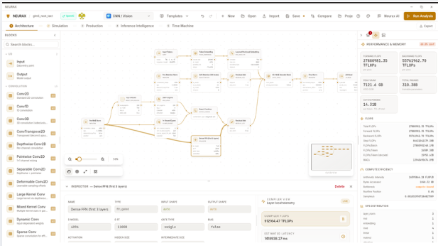
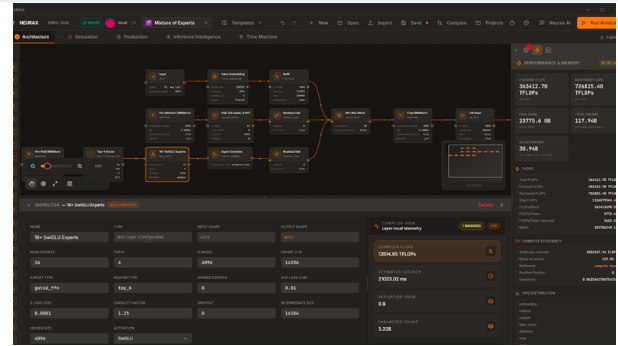
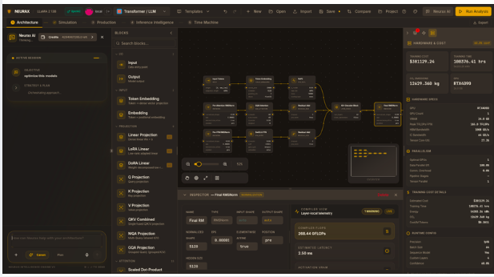
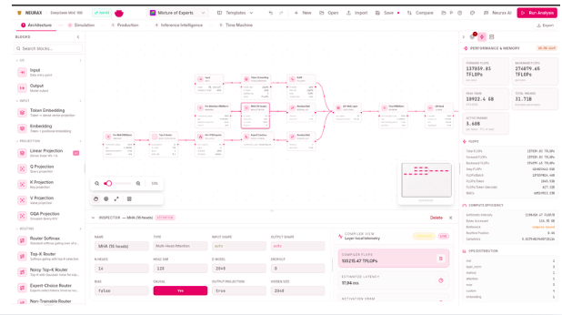

Design · Simulate · Optimize

<h1 class="hero-title">Simulate your model before you spend a GPU-hour finding out if it works</h1>

NEURAX is the environment where you design, simulate, and optimize AI architectures instantly, without training a thing.

<a class="cta-button" href="DESKTOP.md">Get NEURAX free →</a>

<strong>&lt;50ms</strong>per analysis

<strong>0</strong>GPUs required

<strong>8</strong>architecture families

<strong>100%</strong>runs on your machine

## What teams build with NEURAX

Convolutional networks

### See every FLOP before you commit to a design

Lay out a CNN on the canvas and get live FLOPs, parameter counts, and per-layer compute efficiency as you build it. No guessing which layer is the bottleneck.

Mixture of experts

### Know your latency before you route a single token

Sixteen SwiGLU experts, one router, one real latency estimate. Complex architectures get the same instant answer as simple ones.

Large language models

### The full training bill, before training starts

A LLaMA-style transformer with the complete cost breakdown attached: dollars, hours, hardware. The number you'd otherwise only learn from a finished invoice.

Any architecture, one canvas

### Router, attention heads, and cost, together

Compute efficiency sits next to the architecture that produced it, not in a separate spreadsheet you have to keep in sync by hand.

## The problem

Training an AI model today still means committing real money before you know if the design works. A team picks an architecture, rents the GPUs, and finds out hours or days later, mid-run, watching it crash out of memory. Or worse: watching it finish and cost three times the budget.

The numbers back this up. Gartner reports that over half of generative AI projects are abandoned after proof-of-concept, and **escalating cost** is one of the top reasons cited, alongside unclear business value. The industry isn't short on ambition. It's short on a way to know, before spending, whether an idea can actually run.

Global AI infrastructure spending is projected to reach **$497 billion in 2026** (IDC). Every dollar of that sits behind a decision someone made *before* seeing a single result, usually made on intuition, a spreadsheet, or last time's memory.

## Part of a bigger wave

"AI tooling that removes a costly blocker" has become one of the fastest-growing categories in software. Two examples, both real and publicly reported:

<table class="market-table">
<thead>
<tr><th>Company</th><th>What it removes</th><th>Valuation</th><th>Revenue run rate</th></tr>
</thead>
<tbody>
<tr><td>Cursor (Anysphere)</td><td>Writing code by hand</td><td class="figure">$50B</td><td class="figure">~$4B ARR</td></tr>
<tr><td>Lovable</td><td>Needing a developer to ship an app</td><td class="figure">$13.3B</td><td class="figure">~$500–600M ARR</td></tr>
</tbody>
</table>

Cursor: ~$50B valuation, ~$4B annualized revenue as of mid-2026 (TechCrunch, The Next Web). Lovable: $13.3B valuation following its August 2026 Series C, ~$500–600M ARR (TechCrunch).

NEURAX doesn't have a valuation to report. It's early, and that's not the point of showing these. What they demonstrate is real: the market pays enormous amounts to remove a single expensive blocker from a technical workflow. Cursor and Lovable removed the cost of writing software. NEURAX targets the blocker one level up: the **$497 billion** in AI infrastructure spending that sits behind every decision to train a model at all.

## The vision

NEURAX exists to move that decision from after the fact to before you commit. One environment, built around three things engineers actually do when they build a model.

01

### Design

Lay out an architecture on a canvas, or import one from HuggingFace by URL. Drag in blocks, connect them, and see it take shape.

02

### Simulate

See exactly what it will cost: memory, speed, dollars, energy, on the hardware you actually have, computed live as you build.

03

### Optimize

Get concrete, numbered ways to make it fit, run faster, or cost less, computed for *your* design, not a generic tip.

All three happen instantly, without touching a GPU. The idea and the verdict are the same conversation, not separated by a training run.

## What you gain

- **No more surprise failures.** Know if a design fits in memory before you rent anything.
- **No more guessed budgets.** See the real training cost, in dollars and energy, for your actual hardware.
- **Faster iteration.** Compare architecture decisions side by side, in seconds, instead of waiting on a job queue.
- **A second opinion you can trust.** Every number is computed live from the design you built, not looked up from a table of someone else's model.
- **Nothing leaves your machine.** No account, no upload, no data ever sent anywhere you didn't choose.

## Who it's for

<strong>Startups and small teams</strong>
Can't afford a wasted training run, and don't have a platform team to catch mistakes for them.

<strong>ML engineers and researchers</strong>
Building a custom architecture, not just calling an existing model's API.

<strong>Platform and infrastructure teams</strong>
Planning GPU capacity across many models and many teams.

<strong>Anyone learning</strong>
How architecture choices actually translate into cost and performance, with real, immediate feedback.

A small, specialized model tuned to your own dataset gets exactly the same precise answer as a 70-billion-parameter one. That's the case NEURAX is built for as much as the headline-grabbing one.

## Frequently asked questions

Do I need a GPU to use NEURAX?

No. Every analysis is computed analytically, from the architecture's own math, in milliseconds. You never train or run the model to get an answer.

Does my design or data leave my machine?

No. The desktop app runs entirely locally: no account, no upload, no network round-trip to see a result. If you use the optional AI copilot with your own API key, only your prompts go to the provider you chose, never your design's numbers.

Is NEURAX free?

Yes. Download the desktop app for Linux, macOS, or Windows with one command and no account required.

Which architectures does it support?

Eight families with dedicated, verified formulas: Transformer, CNN, MoE, State-space models, Diffusion, GNN, GAN, and RNN. You can also import a model directly from a HuggingFace config.

How accurate are the numbers?

Every reference architecture is checked against its real published parameter count by an automated test that runs on every change, not eyeballed once. See the project's changelog for the full accuracy history.

## Stop finding out the hard way.

One command. No account. Nothing leaves your machine.

<a class="cta-button" href="DESKTOP.md">Install NEURAX →</a>

