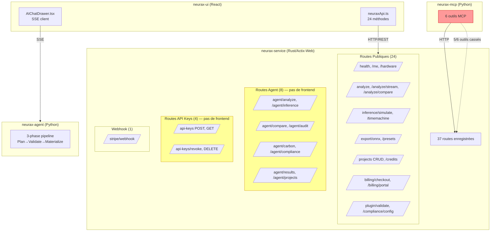
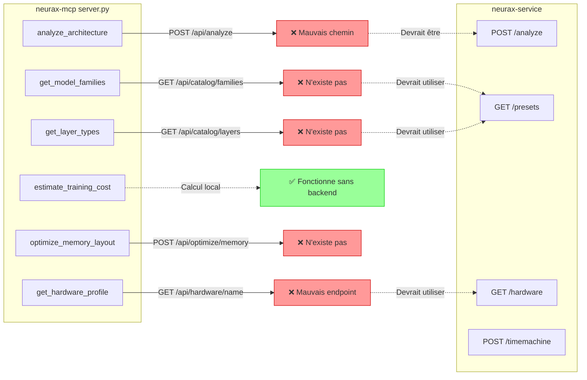

# NEURAX — Rapport de Correction Complet

**Date**: 14 juillet 2026  
**Portée**: Vérification de toutes les routes backend, connexions frontend→backend, code Rust non utilisé, système agentique/MCP, et documentation des routes.

---

## Table des Matières

1. [Routes Backend (neurax-service)](#1-routes-backend-neurax-service)
2. [Connexions Frontend → Backend](#2-connexions-frontend--backend)
3. [Code Rust Non Utilisé](#3-code-rust-non-utilisé)
4. [Système Agentique (neurax-agent)](#4-système-agentique-neurax-agent)
5. [Serveur MCP (neurax-mcp)](#5-serveur-mcp-neurax-mcp)
6. [Documentation des Routes (API_REFERENCE.md)](#6-documentation-des-routes-api_referencemd)
7. [Résumé des Corrections Priorisées](#7-résumé-des-corrections-priorisées)

---

## 1. Routes Backend (neurax-service)

### 1.1 État Général

- **37 routes enregistrées** dans `main()` (lignes 3031–3069 de `neurax-service/src/main.rs`)
- **37 handlers définis** — toutes les routes ont un handler correspondant ✓
- **Aucune route orpheline** (enregistrée sans handler) ✓
- **Aucun handler orphelin** (défini sans route) ✓

### 1.2 Problèmes Fonctionnels Identifiés

| # | Route | Problème | Sévérité | Fichier:Ligne |
|---|---|---|---|---|
| B1 | `POST /plugin/validate` | **Stub** — valide uniquement que le JSON est valide, n'effectue aucune validation de plugin réelle | Moyenne | `main.rs:1674` |
| B2 | `POST /agent/inference` | Ignore le `topology` de la requête pour l'inférence — utilise `InferenceParams::default()` au lieu de dériver les paramètres du modèle | Haute | `main.rs` (handler `agent_inference`) |
| B3 | `POST /agent/carbon` | Doc comment `/// GET /agent/carbon` mais enregistré en POST — incohérence documentation/code | Basse | `main.rs:3066` |
| B4 | `GET /compliance/config` vs `get_compliance_data()` | **Duplication de données** — les réglementations sont définies deux fois avec des années différentes (DSA: 2024 vs 2026, US AI EO: 2023 vs 2024, AIDA: 2025 vs 2027) | Haute | `main.rs:2898` vs `main.rs` (handler `compliance_config`) |
| B5 | `increment_credits()` | Marqué `#[allow(dead_code)]` — les crédits sont suivis mais **jamais décrémentés** par aucun handler | Moyenne | `main.rs:2263` |
| B6 | `noauth_enabled()` | **Défaut à `true`** sauf si `NEURAX_DEBUG_NOAUTH=false` — l'authentification est contournée par défaut en production | **Critique** | `main.rs` (fonction `noauth_enabled`) |
| B7 | `AppState` | **Persistance en mémoire uniquement** — tous les `DashMap` (projects, api_keys, jobs, results, credits) sont perdus au redémarrage | Haute | `main.rs:355` |

### 1.3 Routes Sans Client Frontend

13 routes backend n'ont pas de méthode correspondante dans `neuraxApi.ts`:

| Route | Attendu? | Raison |
|---|---|---|
| `POST /stripe/webhook` | ✓ Oui | Appelée par Stripe, pas par le frontend |
| `POST /api-keys` | ✗ Non | Aucune UI de gestion des clés API |
| `GET /api-keys` | ✗ Non | Aucune UI de gestion des clés API |
| `POST /api-keys/{key_id}/revoke` | ✗ Non | Aucune UI de gestion des clés API |
| `DELETE /api-keys/{key_id}` | ✗ Non | Aucune UI de gestion des clés API |
| `POST /agent/analyze` | ✓ Partiel | Pour accès programmatique (clés API), mais aucune UI |
| `POST /agent/inference` | ✓ Partiel | Idem |
| `POST /agent/compare` | ✓ Partiel | Idem |
| `POST /agent/audit` | ✓ Partiel | Idem |
| `POST /agent/carbon` | ✓ Partiel | Idem |
| `GET /agent/compliance` | ✓ Partiel | Idem |
| `GET /agent/results` | ✓ Partiel | Idem |
| `GET /agent/projects` | ✓ Partiel | Idem |

**Recommandation**: Ajouter une page de gestion des clés API dans le frontend (les endpoints `/api-keys*` sont fonctionnels mais inaccessibles depuis l'UI).

---

## 2. Connexions Frontend → Backend

### 2.1 État Général

- **24 méthodes API** dans `neuraxApi.ts` (735 lignes)
- **Toutes les méthodes frontend appellent des routes backend existantes** ✓
- **Aucune erreur de chemin** — le frontend utilise les chemins sans préfixe `/api/` (ex: `/analyze`, `/health`), ce qui correspond aux routes backend ✓
- Le proxy Vite (`vite.config.ts`) rewrite `/api` → `http://localhost:9098`, mais le client API utilise directement `NEURAX_API_BASE` (défaut: `http://127.0.0.1:9098`)

### 2.2 Correspondances Validées

| Méthode Frontend | Route Backend | Statut |
|---|---|---|
| `getHealth()` | `GET /health` | ✓ |
| `getMe()` | `GET /me` | ✓ |
| `listHardware()` | `GET /hardware` | ✓ |
| `analyze()` | `POST /analyze` | ✓ |
| `validatePlugin()` | `POST /plugin/validate` | ✓ |
| `createCheckoutSession()` | `POST /billing/checkout` | ✓ |
| `createBillingPortalSession()` | `POST /billing/portal` | ✓ |
| `getPresets()` | `GET /presets` | ✓ |
| `getPreset()` | `GET /presets/{id}` | ✓ |
| `runTimeMachine()` | `POST /timemachine` | ✓ |
| `simulateInference()` | `POST /inference/simulate` | ✓ |
| `analyzeStream()` | `POST /analyze/stream` + `GET /analyze/stream/{jobId}` | ✓ |
| `getAnalysisStatus()` | `GET /analyze/status/{jobId}` | ✓ |
| `getAnalysisResult()` | `GET /analyze/result/{jobId}` | ✓ |
| `compareAnalyses()` | `POST /analyze/compare` | ✓ |
| `listProjects()` | `GET /projects` | ✓ |
| `createProject()` | `POST /projects` | ✓ |
| `getProject()` | `GET /projects/{id}` | ✓ |
| `updateProject()` | `PUT /projects/{id}` | ✓ |
| `deleteProject()` | `DELETE /projects/{id}` | ✓ |
| `exportOnnx()` | `POST /export/onnx` | ✓ |
| `getCredits()` | `GET /credits` | ✓ |
| `getComplianceConfig()` | `GET /compliance/config` | ✓ |

### 2.3 Problèmes de Contrat Frontend→Backend

| # | Problème | Détail | Sévérité |
|---|---|---|---|
| F1 | `InferenceSimulateRequest` | Le frontend envoie `topology` + `params` mais le backend `InferenceRequest` n'a que `params` — le `topology` est ignoré | Haute |
| F2 | `TimeMachineRequest` | Le frontend envoie `topology` + `params` mais le backend `TimeMachineRequest` attend `topology` + `params: TimeMachineParams` — structure `params` potentiellement incompatible | Moyenne |
| F3 | `PluginValidateRequest` | Le frontend envoie `{plugin: {...}}` mais la doc API dit `{topology: {...}}` — le code et le frontend sont cohérents, c'est la doc qui est fausse | Basse |

---

## 3. Code Rust Non Utilisé

### 3.1 Dépendances Inutilisées

| Crate | Dépendance | Version | Preuve | Action |
|---|---|---|---|---|
| `neurax-service` | `actix-ws` | `0.2` | Aucun `use actix_ws` dans le code | Supprimer |
| `neurax-service` | `jsonwebtoken` | `9` | Aucun `use jsonwebtoken` dans le code | Supprimer |
| `neurax-service` | `tracing-actix-web` | `0.7` | Aucun `use tracing_actix_web` dans le code | Supprimer |
| `neurax-service` | `futures-util` | `0.3` | Aucun `use futures_util` ou `futures::` dans le code | Supprimer |
| `neurax-tui` | `uuid` | `1.0` | Aucun `use uuid` dans le code | Supprimer |
| `neurax-tui` | `chrono` | workspace | Aucun `use chrono` ou `chrono::` dans le code | Supprimer |
| `neurax-tui` | `serde` | workspace | Aucun `use serde` ou `serde::` dans le code | Supprimer |
| `neurax-tui` | `serde_json` | workspace | Aucun `use serde_json` dans le code | Supprimer |

**Total**: 8 dépendances inutilisées (4 dans `neurax-service`, 4 dans `neurax-tui`).

### 3.2 Code Mort Marqué `#[allow(dead_code)]`

| Fichier:Ligne | Symbole | Raison | Action |
|---|---|---|---|
| `neurax-ir/src/tensor/pass.rs:172` | `propagate_shape()` | Réservé pour future inférence de forme | Garder (documenté comme réservé) |
| `neurax-ir/src/dynamic/behavioral.rs:14` | `model_path: Option<PathBuf>` | Réservé pour futur modèle BPS | Garder (documenté comme réservé) |
| `neurax-service/src/main.rs:2263` | `increment_credits()` | Crédits jamais décrémentés | **Implémenter ou supprimer** |
| `neurax-ir/src/memory/pass.rs:377` | `estimate_memory_time()` | Réservé pour future estimation | Garder (documenté comme réservé) |
| `neurax-ir/src/memory/pass.rs:390` | `calculate_memory_bandwidth()` | Réservé pour future estimation | Garder (documenté comme réservé) |

### 3.3 TODOs/Stubs dans le Code Rust

| Fichier:Ligne | Problème | Impact |
|---|---|---|
| `neurax-ir/src/graph/metrics.rs:9` | `find_parallel_paths` retourne `vec![]` (TODO) | Métrique `parallel_paths` toujours vide |
| `neurax-ir/src/parallelism/pass.rs:109` | `compute_time_ms = 100.0` hardcoded | Affecte `communication_overhead` |
| `neurax-ir/src/cost/pass.rs:55` | `latency_ms = 100.0` hardcoded | **Impact critique sur `training_cost_usd`** |
| `neurax-ir/src/hardware/pass.rs:133` | `flash_attention_enabled = true` hardcoded | FlashAttention toujours activé |
| `neurax-ir/src/dynamic/behavioral.rs:56` | `moe_imbalance = 0.0` (TODO) | Détection MoE non implémentée |
| `neurax-mlir/src/passes/*.rs` (6 fichiers) | Tous les passes sont des stubs `TODO` | Aucune optimisation MLIR réelle |
| `neurax-cli/src/main.rs:210` | Object file = 890 bytes de zéros | Codegen fake |
| `neurax-parser/src/absorption.rs` | `infer_from_neighbors` retourne `None` (TODO) | Stratégie 4/6 de résolution de dims non implémentée |

---

## 4. Système Agentique (neurax-agent)

### 4.1 État Général

- **Pipeline 3 phases** (Plan→Validate→Materialize) ✓
- **Streaming SSE** vers le frontend ✓
- **Auto-détection LLM** (OpenAI/Anthropic/llama.cpp) ✓
- **Catalogue** (`catalogue.json`, 1831 lignes) ✓
- **Validateur de topologie** (10 vérifications) ✓
- **Moteur de layout** déterministe ✓

### 4.2 Problèmes Identifiés

| # | Problème | Sévérité | Fichier |
|---|---|---|---|
| A1 | **Clé API OpenAI commitée** dans `.env` (`sk-proj-ev5MVk_…`) | **CRITIQUE** | `neurax-agent/.env` |
| A2 | **Définitions fan-in dupliquées 4× avec dérive**: `constants.MERGE_BLOCK_TYPES` (11 types), `block_constraints.json` (`max_inputs` par type), `catalogue_store.FAN_IN_CAPABLE_TYPES` (9 types, manque `add`/`merge`/`unet_block`), `suggestions.FAN_IN_CAPABLE_TYPES` (7 types, manque `merge`/`add`/`moe_block`/`unet_block`) | Haute | 4 fichiers |
| A3 | `langchain_runner.run_controller_step` a `single_input_types` hardcoded dupliquant `block_constraints.json` | Moyenne | `langchain_runner.py` |
| A4 | Versions LLM pinées fragiles (`langchain-core 0.2.43`, etc.) avec fallbacks explicites pour échecs structured-output | Moyenne | `requirements.txt` |
| A5 | `verify_arch.py` est un script manuel, pas un test automatisé | Basse | `verify_arch.py` |

### 4.3 Tests Agent

- `tests/test_suggestions.py` (182 lignes, pytest) — couvre `_suggest_hw_defaults`, `set_hw_config`, `_suggest_fix_from_warnings` ✓
- **Aucun test** pour: `arch_planner.py`, `topology_validator.py`, `materializer.py`, `agent_runner.py`, `langchain_runner.py` ✗

---

## 5. Serveur MCP (neurax-mcp)

### 5.1 État Général

Le serveur MCP (`neurax-mcp/neurax_mcp/server.py`, 318 lignes) expose **6 outils** via le protocole MCP (Model Context Protocol).

### 5.2 Problèmes CRITIQUES — Endpoints Inexistants

| # | Outil MCP | Endpoint Appelé | Endpoint Backend Réel | Statut |
|---|---|---|---|---|
| M1 | `analyze_architecture` | `POST /api/analyze` | `POST /analyze` | **MAUvais chemin** (préfixe `/api/` inexistant) |
| M2 | `get_model_families` | `GET /api/catalog/families` | **N'EXISTE PAS** | **Cassé** — aucun endpoint catalog/families |
| M3 | `get_layer_types` | `GET /api/catalog/layers` | **N'EXISTE PAS** | **Cassé** — aucun endpoint catalog/layers |
| M4 | `estimate_training_cost` | (aucun — calcul local) | N/A | **Fonctionne** mais n'utilise pas NEURAX |
| M5 | `optimize_memory_layout` | `POST /api/optimize/memory` | **N'EXISTE PAS** | **Cassé** — aucun endpoint optimize/memory |
| M6 | `get_hardware_profile` | `GET /api/hardware/{gpu_name}` | `GET /hardware` (retourne toutes les GPUs) | **Cassé** — pas d'endpoint par GPU individuel |

### 5.3 Résumé MCP

- **5 outils sur 6 sont cassés** (appellent des endpoints inexistants ou mauvais chemin)
- **1 outil fonctionne** mais ne utilise pas le backend NEURAX (`estimate_training_cost`)
- **0 outil MCP fonctionne correctement** avec le backend NEURAX
- Le serveur MCP est **totalement non fonctionnel** dans l'état actuel

### 5.4 Corrections Requises pour le MCP

1. `analyze_architecture`: changer `POST /api/analyze` → `POST /analyze`
2. `get_model_families`: soit (a) ajouter `GET /catalog/families` au backend, soit (b) utiliser `GET /presets` et grouper par famille
3. `get_layer_types`: soit (a) ajouter `GET /catalog/layers?family=...` au backend, soit (b) utiliser `GET /presets` et filtrer
4. `optimize_memory_layout`: soit (a) ajouter `POST /optimize/memory` au backend, soit (b) utiliser `POST /analyze` et extraire les recommandations
5. `get_hardware_profile`: changer `GET /api/hardware/{gpu_name}` → `GET /hardware` puis filtrer par nom

---

## 6. Documentation des Routes (API_REFERENCE.md)

### 6.1 Incohérences Document/Code

| # | Route | Doc (API_REFERENCE.md) | Code (main.rs) | Sévérité |
|---|---|---|---|---|
| D1 | `GET /me` | Réponse: `{id, email, plan, subscription_status}` | Retourne: `{user_id, plan}` | Haute |
| D2 | `POST /plugin/validate` | Requête: `{topology: {...}}` | Attend: `{plugin: {...}}` | Haute |
| D3 | `POST /inference/simulate` | Requête: `topology + params` | `InferenceRequest` n'a que `params` (pas de `topology`) | Haute |
| D4 | `POST /timemachine` | Requête: `{projection: {months, growth_rate, confidence}}` | Attend: `{topology, params: TimeMachineParams}` | Haute |
| D5 | Variables d'env | `NEURAX_SUPABASE_URL`, `NEURAX_SUPABASE_SERVICE_KEY` | `SUPABASE_URL`, `SUPABASE_SERVICE_ROLE_KEY` | Moyenne |
| D6 | Variables d'env (Stripe) | `NEURAX_ESSENTIAL_PRICE_ID`, etc. | `STRIPE_PRICE_ESSENTIAL_MONTHLY`, etc. | Moyenne |
| D7 | `POST /agent/carbon` | Doc comment `/// GET /agent/carbon` | Enregistré en `POST` | Basse |

### 6.2 Routes Non Documentées

Toutes les routes `/agent/*` (8 endpoints) et `/api-keys/*` (4 endpoints) sont absentes ou partiellement documentées dans `API_REFERENCE.md`.

---

## 7. Résumé des Corrections Priorisées

### 🔴 Critique (Sécurité/Fonctionnalité)

| # | Correction | Fichier | Effort |
|---|---|---|---|
| C1 | **Rotater la clé API OpenAI** commitée dans `neurax-agent/.env` et la supprimer du repo | `neurax-agent/.env` | Immédiat |
| C2 | **Désactiver `noauth_enabled()` par défaut** — changer le défaut à `false` | `neurax-service/src/main.rs` | 1 ligne |
| C3 | **Corriger le serveur MCP** — 5 outils sur 6 appellent des endpoints inexistants | `neurax-mcp/neurax_mcp/server.py` | Moyen |
| C4 | **Corriger `latency_ms = 100.0`** hardcoded dans `cost/pass.rs` — impact critique sur le coût d'entraînement | `neurax-ir/src/cost/pass.rs:55` | Moyen |

### 🟠 Haute (Cohérence/Précision)

| # | Correction | Fichier | Effort |
|---|---|---|---|
| C5 | Unifier les données de compliance (`get_compliance_data()` vs `compliance_config()`) — années incohérentes | `neurax-service/src/main.rs` | Petit |
| C6 | Corriger `agent_inference` pour utiliser le `topology` de la requête au lieu de `InferenceParams::default()` | `neurax-service/src/main.rs` | Moyen |
| C7 | Corriger la doc API (`API_REFERENCE.md`) — 4 incohérences majeures (D1-D4) | `API_REFERENCE.md` | Petit |
| C8 | Corriger les variables d'env dans la doc (D5-D6) | `API_REFERENCE.md` | Petit |
| C9 | Unifier les définitions fan-in (4 sources avec dérive) dans l'agent | `neurax-agent/` (4 fichiers) | Moyen |
| C10 | Implémenter `increment_credits()` ou supprimer le code mort | `neurax-service/src/main.rs:2263` | Petit |
| C11 | Ajouter persistance (Supabase/PostgreSQL) pour Projects/Credits/API keys | `neurax-service/src/main.rs` | Grand |
| C12 | Corriger `InferenceRequest` pour accepter `topology` (ou corriger le frontend) | `neurax-service/src/main.rs` + `neurax-ui/src/services/neuraxApi.ts` | Moyen |

### 🟡 Moyenne (Qualité/Maintenance)

| # | Correction | Fichier | Effort |
|---|---|---|---|
| C13 | Supprimer 8 dépendances Rust inutilisées (4 service + 4 tui) | `Cargo.toml` × 2 | Petit |
| C14 | Implémenter `plugin_validate` correctement (au-delà de la validation JSON) | `neurax-service/src/main.rs` | Moyen |
| C15 | Corriger le doc comment `/// GET /agent/carbon` → `/// POST /agent/carbon` | `neurax-service/src/main.rs` | 1 ligne |
| C16 | Ajouter une UI de gestion des clés API (4 endpoints sans frontend) | `neurax-ui/src/` | Grand |
| C17 | Documenter les routes `/agent/*` et `/api-keys/*` dans `API_REFERENCE.md` | `API_REFERENCE.md` | Petit |
| C18 | Corriger les Docker healthchecks (curl non installé dans slim images) | `Dockerfile`, `Dockerfile.agent` | Petit |
| C19 | Ajouter des tests pour `neurax-service` (5236 lignes, 0 tests) | `neurax-service/tests/` | Grand |
| C20 | Ajouter des tests pour l'agent (arch_planner, topology_validator, materializer, agent_runner) | `neurax-agent/tests/` | Grand |

### 🟢 Basse (Cosmétique/Future)

| # | Correction | Fichier | Effort |
|---|---|---|---|
| C21 | Implémenter `find_parallel_paths` (TODO retourne `vec![]`) | `neurax-ir/src/graph/metrics.rs` | Moyen |
| C22 | Rendre `flash_attention_enabled` configurable au lieu de hardcoded `true` | `neurax-ir/src/hardware/pass.rs:133` | Petit |
| C23 | Implémenter `moe_imbalance` (TODO `= 0.0`) | `neurax-ir/src/dynamic/behavioral.rs:56` | Moyen |
| C24 | Implémenter `infer_from_neighbors` (TODO retourne `None`) | `neurax-parser/src/absorption.rs` | Moyen |
| C25 | Implémenter les 6 passes MLIR (TODO stubs) | `neurax-mlir/src/passes/*.rs` | Grand |
| C26 | Remplacer le codegen fake du CLI (890 bytes de zéros) | `neurax-cli/src/main.rs` | Grand |

---

## Annexe: Diagramme de l'Architecture des Routes

---

## Annexe: Diagramme du Système MCP Cassé

---

*Fin du rapport — 26 corrections identifiées sur 4 niveaux de priorité.*