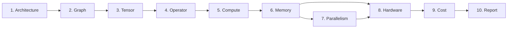

# neurax-ir

**The NEURAX 10-pass intermediate representation — the analytical compiler core.**

Part of [NEURAX](https://github.com/rustnew/NEURAX), the analytical compiler for neural network architectures. This crate defines the IR (intermediate representation) and the **10-pass pipeline** that transforms a parsed model into a complete analytical report: architecture → graph → tensors → operators → compute → memory → parallelism → hardware → cost → report.

> **The vision:** a compiler for neural architectures. Instead of compiling to machine code, NEURAX compiles to *analysis* — every pass adds a layer of understanding, and the final report is the "executable".

## The 10 passes



| # | Pass | IR produced | Answers |
|---|------|-------------|---------|
| 1 | `ArchitecturePass` | `ArchitectureIR` | What blocks exist? How are they connected? |
| 2 | `GraphPass` | `GraphIR` | What is the dataflow graph? |
| 3 | `TensorPass` | `TensorIR` | What tensors flow through the graph? |
| 4 | `OperatorPass` | `OperatorIR` | Which operators execute? |
| 5 | `ComputePass` | `ComputeIR` | How many FLOPs? (uses `neurax-formulas`) |
| 6 | `MemoryPass` | `MemoryIR` | How much memory? Activations, weights, optimizer states |
| 7 | `ParallelismPass` | `ParallelismIR` | How to split across devices? (DP/TP/PP/ZeRO) |
| 8 | `HardwarePass` | `HardwareIR` | What hardware? Utilization, roofline (uses `neurax-hardware-db`) |
| 9 | `CostPass` | `CostIR` | What does it cost? $/hour, energy, total |
| 10 | `ReportPass` | `ReportIR` | The final analytical report (markdown/JSON) |

## Installation

```toml
[dependencies]
neurax-ir = "0.1"
```

## Quick start

```rust
use neurax_ir::{NeuraxContext, ComputeConfig};
use neurax_ir::architecture::ArchitecturePass;
use neurax_ir::graph::GraphPass;
use neurax_ir::compute::ComputePass;
use neurax_ir::report::ReportPass;
use neurax_parser::parse_model_config;

// Parse a model (see neurax-parser)
let config = parse_model_config(MODEL_JSON)?;

// Create the IR context
let ctx = NeuraxContext::new(config.clone());

// Run passes — each transforms the previous pass's IR
let (mut arch, _) = ArchitecturePass.run(&config, &ctx)?;
let (mut graph, _) = GraphPass.run(&arch, &ctx)?;
let (mut compute, _) = ComputePass.run(&graph, &ctx)?;

// Inspect metrics
let flops = compute.total_flops;
println!("Total FLOPs: {:.2e}", flops);
```

## The `IrPass` trait

Every pass implements the same trait — this is what makes the pipeline composable:

```rust
pub trait IrPass: Send + Sync {
    type Input;      // IR from the previous pass
    type Output;     // IR produced by this pass
    type Metrics;    // Metrics computed by this pass
    type PassError: Into<NeuraxError>;

    fn build(&self, input: &Self::Input, ctx: &NeuraxContext) -> Result<Self::Output, Self::PassError>;
    fn compute_metrics(&self, output: &mut Self::Output, ctx: &NeuraxContext) -> Result<Self::Metrics, Self::PassError>;
    fn validate(&self, output: &Self::Output, metrics: &Self::Metrics) -> Result<(), Self::PassError>;
    fn name(&self) -> &'static str;
}
```

## Diagnostics

Passes emit structured diagnostics (`Diagnostic` with `Severity`, `DiagnosticCode`, `DiagnosticCategory`) into the shared `NeuraxContext` — warnings about missing fields, confidence scores, and coherence issues surface here.

## Using it in the pipeline

For end-to-end analysis use [`neurax-core`](https://crates.io/crates/neurax-core), which orchestrates all 10 passes (with parallelism via rayon) and produces the final report:

```rust
use neurax_core::analyze_json;

let result = analyze_json(MODEL_JSON)?;
println!("{}", result.report_markdown);
```

## License

MIT — see the [NEURAX repository](https://github.com/rustnew/NEURAX) for details.